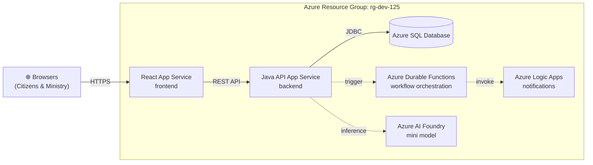
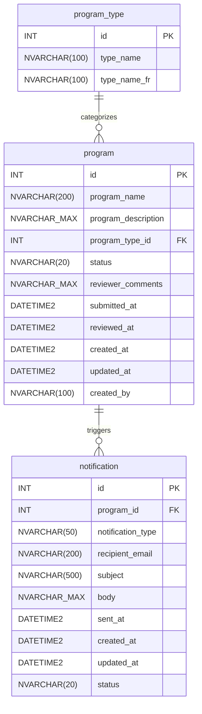

<!-- markdownlint-disable-file -->
# Implementation Details: Demo Scaffolding

## Context Reference

Sources: [demo-scaffolding-research.md](../../research/2026-03-02/demo-scaffolding-research.md) (primary, 948 lines), [configuration-layer-research.md](../../research/subagents/2026-03-02/configuration-layer-research.md), [documentation-layer-research.md](../../research/subagents/2026-03-02/documentation-layer-research.md), [operational-layer-research.md](../../research/subagents/2026-03-02/operational-layer-research.md), [demo-scaffolding.prompt.md](../../.github/prompts/demo-scaffolding.prompt.md), [README.md](../../README.md)

## Implementation Phase 1: Configuration Layer — Core Files

<!-- parallelizable: true -->

### Step 1.1: Create `.gitignore`

Create `.gitignore` at repository root with combined Java + Node + IDE + OS rules. Use comment section headers for readability.

Files:
* `.gitignore` - Combined ignore rules for Java/Maven, Node/Vite, IDE, and OS files

Discrepancy references:
* None — research fully specifies content

Content structure (from research §1.1):

```gitignore
# === Java / Maven ===
target/
*.class
*.jar
*.war
*.ear
!**/src/main/**/build/
!**/src/test/**/build/
*.log
hs_err_pid*
replay_pid*
.mvn/timing.properties
.mvn/wrapper/maven-wrapper.jar

# === Node / Vite ===
node_modules/
dist/
.env
.env.local
.env.*.local
*.local
coverage/
.eslintcache

# === IDE ===
.idea/
*.iml
*.iws
*.ipr
.vscode/settings.json
.vscode/launch.json
.project
.classpath
.settings/
.factorypath
*.swp
*~

# === OS ===
.DS_Store
Thumbs.db
desktop.ini
ehthumbs.db
```

Key decisions:
* `.vscode/mcp.json` must NOT be ignored — it is shared project configuration
* Maven wrapper scripts (`mvnw`, `mvnw.cmd`) committed; only downloaded JAR ignored
* `*.local` covers Vite local-only config files
* `replay_pid*` covers Java 21+ JVM replay files

Success criteria:
* File exists at `.gitignore`
* Contains all 4 sections with comment headers
* `.vscode/mcp.json` is NOT listed

Context references:
* [demo-scaffolding-research.md](../../research/2026-03-02/demo-scaffolding-research.md) (Lines 54-95) - `.gitignore` specification

Dependencies:
* None — first file, no prerequisites

### Step 1.2: Create `.vscode/mcp.json`

Create MCP server configuration for Azure DevOps integration. Use the prompt-specified `azure-devops-mcp` package (community), not the official `@azure-devops/mcp`.

Files:
* `.vscode/mcp.json` - ADO MCP server configuration

Discrepancy references:
* DR-01 — Research notes official package is superior, but prompt specifies community package

Content:

```json
{
  "servers": {
    "ado": {
      "type": "stdio",
      "command": "npx",
      "args": ["-y", "azure-devops-mcp", "--organization", "MngEnvMCAP675646", "--project", "ProgramDemo-DevDay2026-DryRun2"]
    }
  }
}
```

Success criteria:
* File exists at `.vscode/mcp.json`
* Valid JSON with correct server name, type, command, and args
* Organization and project match ADO configuration

Context references:
* [demo-scaffolding-research.md](../../research/2026-03-02/demo-scaffolding-research.md) (Lines 97-122) - MCP configuration specification

Dependencies:
* None — independent file

### Step 1.3: Create `.github/copilot-instructions.md`

Create global Copilot context file. No `applyTo` frontmatter — applies to all interactions automatically. Keep under 2000 tokens. Reference domain-specific instruction files rather than duplicating content.

Files:
* `.github/copilot-instructions.md` - Global Copilot context

Discrepancy references:
* None — research fully specifies content

Content elements (from research §1.3):

| Element | Detail |
|---------|--------|
| Project overview | OPS Program Approval System for Developer Day 2026 |
| Tech stack table | React 18 + TS (frontend), Java 21 + Spring Boot 3.x (backend), Azure SQL (database) |
| Bilingual EN/FR | All user-facing text via i18next with `en.json`/`fr.json` |
| WCAG 2.2 Level AA | Semantic HTML, aria attributes, keyboard nav, 4.5:1 contrast, `lang` attribute |
| Ontario Design System | Use ontario-design-system CSS classes |
| Commit format | `AB#{id} <description>` |
| Branch naming | `feature/{id}-description` |
| PR linking | `Fixes AB#{id}` in PR description body |
| Project structure | `frontend/`, `backend/`, `database/` |
| ADO MCP reference | "This project uses Azure DevOps. Always check to see if the Azure DevOps MCP server has a tool relevant to the user's request." |

Structure:
```markdown
# OPS Program Approval System

## Project Overview
(one paragraph)

## Tech Stack
(table: Layer | Technology)

## Project Structure
(directory layout: frontend/, backend/, database/)

## Standards
- Bilingual EN/FR via i18next
- WCAG 2.2 Level AA
- Ontario Design System CSS classes

## Git Conventions
- Commit: `AB#{id} <description>`
- Branch: `feature/{id}-description`
- PR: Include `Fixes AB#{id}` in description

## Azure DevOps Integration
This project uses Azure DevOps. Always check to see if the Azure DevOps MCP server has a tool relevant to the user's request.
```

Success criteria:
* File exists at `.github/copilot-instructions.md`
* Contains all 10 required content elements from research §1.3
* Under 2000 tokens
* No `applyTo` frontmatter
* References instruction files for stack-specific details, does not duplicate their content

Context references:
* [demo-scaffolding-research.md](../../research/2026-03-02/demo-scaffolding-research.md) (Lines 124-155) - Copilot instructions specification

Dependencies:
* None — independent file

## Implementation Phase 2: Configuration Layer — Instruction Files

<!-- parallelizable: true -->

### Step 2.1: Create `.github/instructions/ado-workflow.instructions.md`

Create ADO workflow conventions file with `applyTo: '**'` frontmatter.

Files:
* `.github/instructions/ado-workflow.instructions.md` - ADO branching, commit, PR conventions

Discrepancy references:
* None — research fully specifies content

Frontmatter:
```yaml
---
description: "Azure DevOps workflow conventions for branching, commits, and pull requests"
applyTo: '**'
---
```

Content (from research §1.4):

| Convention | Pattern | Effect |
|------------|---------|--------|
| Branch naming | `feature/{id}-description` | Informational (no auto-linking) |
| Commit message | `AB#{id} <description>` | Links commit to ADO work item |
| PR description | `Fixes AB#{id}` | Links PR and transitions work item to Done on merge |
| Post-merge | Delete feature branch | Clean repository |
| Commit style | Imperative mood, ≤72 char subject | Git best practice |

Include a note about `AB#` syntax requiring Azure Boards GitHub integration configured in ADO project settings.

Success criteria:
* File exists at `.github/instructions/ado-workflow.instructions.md`
* Valid frontmatter with `applyTo: '**'`
* All 5 conventions documented with patterns and effects
* Pitfall about Azure Boards integration noted

Context references:
* [demo-scaffolding-research.md](../../research/2026-03-02/demo-scaffolding-research.md) (Lines 157-180) - ADO workflow specification

Dependencies:
* None — independent file

### Step 2.2: Create `.github/instructions/java.instructions.md`

Create Java/Spring Boot conventions file with `applyTo: 'backend/**'` frontmatter. This is the most content-heavy instruction file.

Files:
* `.github/instructions/java.instructions.md` - Java 21 + Spring Boot 3.x conventions

Discrepancy references:
* None — research fully specifies content

Frontmatter:
```yaml
---
description: "Java 21 and Spring Boot 3.x conventions for the backend API"
applyTo: 'backend/**'
---
```

Content sections (from research §1.5):

**Conventions table:**

| Area | Convention |
|------|-----------|
| Java version | Java 21 (records for DTOs, pattern matching, text blocks) |
| Framework | Spring Boot 3.x with Spring Data JPA |
| Base package | `com.ontario.program` |
| Injection | Constructor injection only (no `@Autowired` on fields) |
| Validation | `@Valid` + Bean Validation (`@NotBlank`, `@NotNull`, `@Size`, `@Pattern`) |
| Return types | `ResponseEntity` from all controller methods |
| Error handling | `ProblemDetail` (RFC 7807) via `@RestControllerAdvice` |
| Database dev | H2 with `MODE=MSSQLServer` in `local` profile |
| Migrations | Flyway in `src/main/resources/db/migration/` |
| DDL auto | `validate` (never `update` or `create-drop` with Flyway) |

**Project structure:**
```text
backend/src/main/java/com/ontario/program/
├── ProgramApplication.java
├── config/
├── controller/
├── dto/
├── exception/
├── model/
├── repository/
└── service/
```

**H2 local profile configuration** (`application-local.yml`):
```yaml
spring:
  datasource:
    url: jdbc:h2:mem:programdb;MODE=MSSQLServer;DATABASE_TO_LOWER=TRUE
    driver-class-name: org.h2.Driver
    username: sa
    password:
  h2:
    console:
      enabled: true
  jpa:
    hibernate:
      ddl-auto: validate
  flyway:
    enabled: true
```

**Pitfalls to document:**
* `@NotBlank` only works on `CharSequence` types — use `@NotNull` for `Integer` fields like `programTypeId`
* H2 `MODE=MSSQLServer` does not support `sys.tables`/`sys.columns` views
* Base package must be at or above `@SpringBootApplication` for component scanning
* Enable ProblemDetail via `spring.mvc.problemdetails.enabled: true`

Success criteria:
* File exists at `.github/instructions/java.instructions.md`
* Valid frontmatter with `applyTo: 'backend/**'`
* All conventions documented including project structure
* H2 local profile config included
* All 4 pitfalls documented

Context references:
* [demo-scaffolding-research.md](../../research/2026-03-02/demo-scaffolding-research.md) (Lines 182-249) - Java conventions specification

Dependencies:
* None — independent file

### Step 2.3: Create `.github/instructions/react.instructions.md`

Create React/TypeScript conventions file with `applyTo: 'frontend/**'` frontmatter. Include Ontario Design System CSS class reference and WCAG 2.2 criteria.

Files:
* `.github/instructions/react.instructions.md` - React 18 + TypeScript + Vite conventions

Discrepancy references:
* None — research fully specifies content

Frontmatter:
```yaml
---
description: "React 18 with TypeScript and Vite conventions for the frontend application"
applyTo: 'frontend/**'
---
```

Content sections (from research §1.6):

**Conventions table:**

| Area | Convention |
|------|-----------|
| Framework | React 18 + TypeScript strict mode |
| Build tool | Vite with `server.port: 3000` |
| Components | Functional components with hooks only |
| i18n | i18next with `en.json`/`fr.json`, `react-i18next`, `i18next-browser-languagedetector` |
| Design system | Ontario Design System CSS classes (`@ongov/ontario-design-system-global-styles`) |
| Accessibility | WCAG 2.2 Level AA |
| Routing | `react-router-dom` v6 |
| HTTP client | axios with centralized API client |
| Exports | Named exports (not default) |
| `lang` attribute | Set dynamically on `<html>` based on selected language |

**Ontario DS CSS classes table** — 15 class mappings from research §1.6 (container, header, footer, buttons, inputs, alerts, etc.)

**i18next configuration example** — from research §1.6 showing `LanguageDetector`, `initReactI18next`, resources, fallbackLng, supportedLngs

**WCAG 2.2 Level AA criteria table** — 8 key criteria from research (1.1.1, 1.3.1, 1.4.3, 2.1.1, 2.4.7, 2.4.11, 3.1.1, 3.3.1)

**Vite config with API proxy** — port 3000, proxy `/api` to `localhost:8080`

**Pitfalls to document:**
* Hardcoding English strings bypasses i18next and breaks French
* Using `div` with `onClick` instead of `button` breaks keyboard accessibility
* Ontario DS CSS may conflict with other CSS resets — load it before app styles

Success criteria:
* File exists at `.github/instructions/react.instructions.md`
* Valid frontmatter with `applyTo: 'frontend/**'`
* Ontario DS CSS class table with all 15 entries
* i18next configuration example included
* WCAG 2.2 criteria table with all 8 entries
* Vite proxy config included
* All 3 pitfalls documented

Context references:
* [demo-scaffolding-research.md](../../research/2026-03-02/demo-scaffolding-research.md) (Lines 251-333) - React conventions specification

Dependencies:
* None — independent file

### Step 2.4: Create `.github/instructions/sql.instructions.md`

Create SQL conventions file with `applyTo: 'database/**'` frontmatter.

Files:
* `.github/instructions/sql.instructions.md` - Azure SQL and Flyway migration conventions

Discrepancy references:
* None — research fully specifies content

Frontmatter:
```yaml
---
description: "Azure SQL and Flyway migration conventions for the database layer"
applyTo: 'database/**'
---
```

Content (from research §1.7):

**Conventions table:**

| Area | Convention |
|------|-----------|
| Target | Azure SQL (H2 locally with `MODE=MSSQLServer`) |
| Migrations | Flyway versioned: `V001__description.sql` |
| Text columns | `NVARCHAR` (Unicode for EN/FR) |
| Primary keys | `INT IDENTITY(1,1)` |
| Timestamps | `DATETIME2` |
| DDL guards | `IF NOT EXISTS` on CREATE TABLE and ALTER TABLE |
| Seed data | `INSERT ... WHERE NOT EXISTS` (never MERGE) |
| Audit columns | `created_at`, `updated_at`, `created_by` where applicable |
| Naming | `PK_tablename`, `FK_tablename_reference` |
| Rule | One logical change per migration file; never modify applied migrations |

**Key notes:**
* Why avoid MERGE: SQL Server MERGE has documented concurrency bugs — `INSERT ... WHERE NOT EXISTS` is idempotent and safe
* H2 compatibility: Supports `IDENTITY(1,1)`, `NVARCHAR`, `DATETIME2`, `GETDATE()`. Does NOT support `sys.tables`/`sys.columns`

Success criteria:
* File exists at `.github/instructions/sql.instructions.md`
* Valid frontmatter with `applyTo: 'database/**'`
* All 10 conventions documented
* MERGE avoidance rationale included
* H2 compatibility notes included

Context references:
* [demo-scaffolding-research.md](../../research/2026-03-02/demo-scaffolding-research.md) (Lines 335-365) - SQL conventions specification

Dependencies:
* None — independent file

## Implementation Phase 3: Documentation Layer

<!-- parallelizable: true -->

### Step 3.1: Create `docs/architecture.md`

Create architecture document with Mermaid flowchart, Azure resource table, and data flow narrative.

Files:
* `docs/architecture.md` - System architecture with Mermaid diagram

Discrepancy references:
* DD-01 — Using `flowchart LR` instead of C4 (research recommendation for demo reliability)

Content structure (from research §2.1):

**YAML frontmatter:**
```yaml
---
title: "Architecture"
description: "High-level system architecture for the OPS Program Approval application deployed to Azure resource group rg-dev-125"
---
```

**Sections:**
1. **Overview** — Narrative paragraph describing the system
2. **System Diagram** — Mermaid `flowchart LR` with `subgraph rg["Azure Resource Group: rg-dev-125"]`
   * Solid lines for core data flow (browsers → React → Java API → Azure SQL)
   * Dashed lines for stretch-goal services (Durable Functions, Logic Apps, AI Foundry)
3. **Azure Resources** — Table with columns: Resource, Type, Purpose
4. **Data Flow** — Numbered steps (1. Citizen submits → 2. React sends POST → 3. API validates → etc.)

**Mermaid diagram** (from research §2.1):


Success criteria:
* File exists at `docs/architecture.md`
* Valid YAML frontmatter with title and description
* Mermaid flowchart renders correctly with subgraph boundary
* Dashed lines distinguish stretch-goal services
* Azure resource table lists all 6 resources
* Data flow section has numbered steps

Context references:
* [demo-scaffolding-research.md](../../research/2026-03-02/demo-scaffolding-research.md) (Lines 367-416) - Architecture specification
* [README.md](../../README.md) (Lines 26-36) - Tech stack table

Dependencies:
* None — independent file

### Step 3.2: Create `docs/data-dictionary.md`

Create data dictionary with Mermaid ER diagram, column specification tables for all 3 tables, and seed data.

Files:
* `docs/data-dictionary.md` - Database schema documentation with ER diagram

Discrepancy references:
* None — research fully specifies content

Content structure (from research §2.2):

**Sections:**
1. **ER Diagram** — Mermaid `erDiagram` showing `program_type ||--o{ program : "categorizes"` and `program ||--o{ notification : "triggers"`
   * Use `NVARCHAR_MAX` (underscore) in Mermaid to avoid parser issues
2. **Tables** — One subsection per table with columns: Column, Type, Constraints, Description
   * `program_type` — 3 columns, simple lookup, no audit columns
   * `program` — 11 columns, core entity with audit columns, status lifecycle
   * `notification` — 10 columns, system-generated, no `created_by`
3. **Status Lifecycle** — `DRAFT` → `SUBMITTED` → `APPROVED` or `REJECTED`
   * Note: `POST /api/programs` sets status to `SUBMITTED` explicitly (overrides DB default)
4. **Seed Data** — 5 program types table (EN/FR) with `INSERT ... WHERE NOT EXISTS` pattern

**Mermaid ER diagram** (from research §2.2 — use exact syntax to avoid rendering issues):


**Seed data table:**

| id | type_name (EN) | type_name_fr (FR) |
|----|----------------|-------------------|
| 1 | Community Services | Services communautaires |
| 2 | Health & Wellness | Santé et bien-être |
| 3 | Education & Training | Éducation et formation |
| 4 | Environment & Conservation | Environnement et conservation |
| 5 | Economic Development | Développement économique |

**Seed insertion pattern:**
```sql
INSERT INTO program_type (type_name, type_name_fr)
SELECT N'Community Services', N'Services communautaires'
WHERE NOT EXISTS (
    SELECT 1 FROM program_type WHERE type_name = N'Community Services'
);
```

Success criteria:
* File exists at `docs/data-dictionary.md`
* Mermaid ER diagram renders with correct relationships
* All 3 tables documented with complete column specs
* Status lifecycle documented with POST override note
* 5 seed data entries with EN/FR names
* Seed insertion pattern uses `INSERT ... WHERE NOT EXISTS`

Context references:
* [demo-scaffolding-research.md](../../research/2026-03-02/demo-scaffolding-research.md) (Lines 418-530) - Data dictionary specification

Dependencies:
* None — independent file

### Step 3.3: Create `docs/design-document.md`

Create design document with API endpoints, request/response DTOs, RFC 7807 error format, and frontend component hierarchy.

Files:
* `docs/design-document.md` - API design and frontend component structure

Discrepancy references:
* None — research fully specifies content

Content structure (from research §2.3):

**Sections:**

1. **API Endpoints** — 5 endpoints documented with:
   * HTTP method, path, description
   * Status codes
   * Request body (with DTO reference)
   * Response body (with DTO reference)
   * Special notes (e.g., 409 Conflict for already-reviewed programs)

   Endpoints:
   1. `POST /api/programs` — Submit a program (201, 400, 500)
   2. `GET /api/programs` — List all programs (200) with optional `status` and `search` query params
   3. `GET /api/programs/{id}` — Get single program (200, 404)
   4. `PUT /api/programs/{id}/review` — Approve or reject (200, 400, 404, 409)
   5. `GET /api/program-types` — Dropdown values (200)

2. **Request DTOs** — Java records with Bean Validation annotations:
   * `ProgramSubmitRequest` — `@NotBlank`, `@Size`, `@NotNull`
   * `ProgramReviewRequest` — `@NotBlank`, `@Pattern(regexp = "APPROVED|REJECTED")`

3. **Response DTOs** — Java records:
   * `ProgramResponse` — includes both EN/FR type names
   * `ProgramTypeResponse` — `id`, `typeName`, `typeNameFr`
   * Note: Response includes both EN/FR — frontend selects language client-side

4. **RFC 7807 ProblemDetail** — JSON example with `type`, `title`, `status`, `detail`, `instance`
   * 400 Bad Request example
   * 404 Not Found example
   * 409 Conflict example

5. **Frontend Component Hierarchy** — ASCII tree showing component structure and route table:
   ```text
   App
   └── Layout
       ├── Header
       │   └── LanguageToggle
       ├── Footer
       └── <Router Outlet>
           ├── SubmitProgram          /submit
           ├── SubmitConfirmation     /submit/confirmation
           ├── SearchPrograms         /search
           ├── ReviewDashboard        /review
           └── ReviewDetail           /review/:id
   ```

6. **Component Route Table** — Component, Route, Purpose for all 6 components

Success criteria:
* File exists at `docs/design-document.md`
* All 5 API endpoints documented with status codes
* Request DTOs include Bean Validation annotations
* Response DTOs include EN/FR type name note
* RFC 7807 examples for 400, 404, 409
* Component hierarchy with routes matches research specification

Context references:
* [demo-scaffolding-research.md](../../research/2026-03-02/demo-scaffolding-research.md) (Lines 532-596) - Design document specification

Dependencies:
* None — independent file

## Implementation Phase 4: Operational Layer — Scripts

<!-- parallelizable: true -->

### Step 4.1: Create `scripts/Start-Local.ps1`

Create PowerShell script to start backend and/or frontend locally with parameter switches.

Files:
* `scripts/Start-Local.ps1` - Local development startup script

Discrepancy references:
* None — research fully specifies content

Content (from research §3.2):

**Comment-based help** (`.SYNOPSIS`, `.DESCRIPTION`, `.PARAMETER`, `.EXAMPLE`)

**Parameters:**
```powershell
param(
    [switch]$SkipBuild,
    [switch]$BackendOnly,
    [switch]$FrontendOnly,
    [switch]$UseAzureSql
)
```

**Implementation requirements:**
* Prerequisite checks — verify `java` and `node`/`npm` exist via `Get-Command`
* Mutual exclusion — error if both `-BackendOnly` and `-FrontendOnly` specified
* `-UseAzureSql` validates `AZURE_SQL_URL`, `AZURE_SQL_USERNAME`, `AZURE_SQL_PASSWORD` environment variables
* Maven wrapper — use `.\mvnw.cmd` on Windows
* Spring profile — set `SPRING_PROFILES_ACTIVE` to `local` or `azure`
* `Start-Process` — each service in its own terminal window (not background jobs)
* Backend: port 8080 with `spring-boot:run`
* Frontend: port 3000 with `npm run dev`
* Build steps (unless `-SkipBuild`): `.\mvnw.cmd package -DskipTests` for backend, `npm install` for frontend
* Summary output with URLs after startup

Success criteria:
* File exists at `scripts/Start-Local.ps1`
* Comment-based help with all 4 parameters documented
* Prerequisite checks for java and node
* Mutual exclusion for `-BackendOnly`/`-FrontendOnly`
* `-UseAzureSql` env var validation
* `Start-Process` used for service startup
* Summary output with URLs

Context references:
* [demo-scaffolding-research.md](../../research/2026-03-02/demo-scaffolding-research.md) (Lines 745-795) - Start-Local specification

Dependencies:
* None — independent file

### Step 4.2: Create `scripts/Stop-Local.ps1`

Create PowerShell script to kill processes on ports 8080 and 3000.

Files:
* `scripts/Stop-Local.ps1` - Local development stop script

Discrepancy references:
* None — research fully specifies content

Content (from research §3.3):

**Implementation:**
```powershell
function Stop-ProcessOnPort {
    param([int]$Port, [string]$ServiceName)
    $connections = Get-NetTCPConnection -LocalPort $Port -State Listen -ErrorAction SilentlyContinue
    if (-not $connections) {
        Write-Host "[$ServiceName] No process found on port $Port." -ForegroundColor DarkGray
        return
    }
    $pids = $connections | Select-Object -ExpandProperty OwningProcess -Unique
    foreach ($processId in $pids) {
        $proc = Get-Process -Id $processId -ErrorAction SilentlyContinue
        if ($proc) {
            Write-Host "[$ServiceName] Stopping $($proc.ProcessName) (PID: $processId)..." -ForegroundColor Yellow
            Stop-Process -Id $processId -Force
        }
    }
}

Stop-ProcessOnPort -Port 8080 -ServiceName "Backend"
Stop-ProcessOnPort -Port 3000 -ServiceName "Frontend"
```

**Key decisions:**
* `-Force` for instant cleanup (appropriate for demo context)
* `-ErrorAction SilentlyContinue` handles "no process on port" gracefully
* `Select-Object -Unique` avoids killing same PID twice (IPv4 + IPv6 listeners)
* Windows-only (cross-platform is out of scope)

**Comment-based help** (`.SYNOPSIS`, `.DESCRIPTION`, `.EXAMPLE`)

Success criteria:
* File exists at `scripts/Stop-Local.ps1`
* Comment-based help included
* `Stop-ProcessOnPort` function handles both ports
* `-ErrorAction SilentlyContinue` for graceful handling
* `-Force` on `Stop-Process`

Context references:
* [demo-scaffolding-research.md](../../research/2026-03-02/demo-scaffolding-research.md) (Lines 797-835) - Stop-Local specification

Dependencies:
* None — independent file

## Implementation Phase 5: Talk Track

<!-- parallelizable: false -->

### Step 5.1: Create `TALK-TRACK.md` Part 1 — "Building From Zero" (Minutes 0–70)

Create the first half of the 130-minute demo script. This is a large file; implement it as a single file with clear section boundaries.

Files:
* `TALK-TRACK.md` (repository root) - 130-minute demo script

Discrepancy references:
* None — research fully specifies content

Content structure for Part 1 (from research §3.1):

**Opening (Minutes 0–8):**
* Presenter dialogue in blockquotes
* Show empty repo, Azure portal (`rg-dev-125`), empty ADO board
* `Key beat:` "Everything you see from this point was built by AI"
* `Audience engagement point:` "How many of you have built a full-stack app in under 2 hours?"

**Act 1: The Architect (Minutes 8–20):**
* Run scaffolding prompts
* Configure MCP
* Create ADO Epic/Features/Stories via MCP
* Checkpoint: tag `v0.1.0`

**Act 2: The DBA (Minutes 20–32):**
* 4 Flyway SQL migrations
* Checkpoint: tag `v0.2.0`

**Act 3: The Backend Developer (Minutes 32–52):**
* Spring Boot scaffolding + 5 API endpoints
* Live curl tests
* Checkpoint: tag `v0.3.0`

**Act 4: The Frontend Developer (Minutes 52–70):**
* React + Ontario DS + bilingual citizen portal
* Live form submission
* Checkpoint: tag `v0.4.0`
* End with cliffhanger: Ministry Portal stories still "New" on ADO board

**Formatting:**
* Scripted dialogue in blockquotes (`> "What to say"`)
* Demo actions as bullet lists with `[Minute XX]` markers
* `Key beat:` callouts for critical impact moments
* `Audience engagement point:` callouts for natural pauses
* Expected output after each action

Success criteria:
* Part 1 covers minutes 0–70 with all 4 acts plus opening
* All formatting requirements met (blockquotes, minute markers, callouts)
* Cliffhanger documented at minute 70
* 4 checkpoint tags documented (v0.1.0 through v0.4.0)

Context references:
* [demo-scaffolding-research.md](../../research/2026-03-02/demo-scaffolding-research.md) (Lines 660-725) - Talk track Part 1 specification

Dependencies:
* None — new file creation

### Step 5.2: Create `TALK-TRACK.md` Part 2 — "Closing the Loop" (Minutes 70–130)

Append Part 2 content to the same `TALK-TRACK.md` file.

Content structure for Part 2 (from research §3.1):

**Recap (Minutes 70–73):**
* Quick recap, show database with submissions

**Act 5: Completing the Story (Minutes 73–87):**
* Ministry review dashboard, detail, approve/reject
* Checkpoint: tag `v0.5.0`

**Act 6: The QA Engineer (Minutes 87–100):**
* Backend controller tests, frontend component tests, accessibility
* Checkpoint: tag `v0.6.0`

**Act 7: The DevOps Engineer (Minutes 100–107):**
* CI pipeline, Dependabot, secret scanning, GHAS
* Checkpoint: tag `v0.7.0`

**Act 8: The Full Stack Change (Minutes 107–120):**
* Add `program_budget` field end-to-end
* Checkpoint: tag `v0.8.0`

**Closing (Minutes 120–130):**
* Summary stats, ADO board all done, Q&A
* Final checkpoint: tag `v1.0.0`

Success criteria:
* Part 2 covers minutes 70–130 with recap, 4 acts, and closing
* All formatting requirements met
* 5 checkpoint tags documented (v0.5.0 through v1.0.0)

Context references:
* [demo-scaffolding-research.md](../../research/2026-03-02/demo-scaffolding-research.md) (Lines 725-745) - Talk track Part 2 specification

Dependencies:
* Step 5.1 — file must exist before appending Part 2 (or create as single file)

### Step 5.3: Add recovery matrix, checkpoints, and key numbers summary

Add supporting sections to `TALK-TRACK.md` after Part 2.

Content (from research §3.1):

**Recovery Decision Matrix:**

| Situation | Time Lost | Action |
|-----------|-----------|--------|
| Copilot generates wrong code | < 2 min | Fix manually, continue |
| Copilot generates wrong code | 2–5 min | Retry once, then fast-forward |
| Build/compile error | > 2 min | Fast-forward to checkpoint |
| Azure connectivity lost | Any | Switch to H2 local, continue |
| Total overrun > 10 min | — | Skip Act 6 (QA) or Act 7 (DevOps) |

**9 Tagged Checkpoints table** with Tag, Checkpoint name, Contents, and Minute

**Key Numbers Summary table** (from research §3.1) — 14 metrics

Success criteria:
* Recovery matrix with 5 scenarios
* Checkpoint table with all 9 tags (v0.1.0 through v1.0.0)
* Key numbers summary with all 14 metrics

Context references:
* [demo-scaffolding-research.md](../../research/2026-03-02/demo-scaffolding-research.md) (Lines 690-745) - Recovery and checkpoints

Dependencies:
* Steps 5.1, 5.2 — file must contain both parts before adding supporting sections (or create as single file)

## Implementation Phase 6: ADO Work Items via MCP

<!-- parallelizable: false -->

### Step 6.1: Create Epic "OPS Program Approval System"

Use the Azure DevOps MCP server to create the top-level Epic work item.

Files:
* No files — MCP operation

Discrepancy references:
* None — research fully specifies content

Action:
* Create Epic with title "OPS Program Approval System" in ADO project `ProgramDemo-DevDay2026-DryRun2`
* Initial state: New
* Record the Epic work item ID for use as parent in Step 6.2

Success criteria:
* Epic exists in ADO with correct title
* Epic ID captured for parent linking

Context references:
* [demo-scaffolding-research.md](../../research/2026-03-02/demo-scaffolding-research.md) (Lines 838-845) - Epic specification

Dependencies:
* MCP server configured (`.vscode/mcp.json` from Step 1.2)
* ADO project accessible

### Step 6.2: Create 8 Features under the Epic

Create all 8 Features as children of the Epic.

Action:
* Create 8 Features with parent = Epic ID:
  1. Infrastructure Setup
  2. Database Layer
  3. Backend API
  4. Citizen Portal
  5. Ministry Portal
  6. Quality Assurance
  7. CI/CD Pipeline
  8. Live Change Demo
* All initial state: New
* Record Feature IDs for Story parenting in Step 6.3

Success criteria:
* 8 Features exist under Epic
* All Feature IDs captured

Context references:
* [demo-scaffolding-research.md](../../research/2026-03-02/demo-scaffolding-research.md) (Lines 847-860) - Features specification

Dependencies:
* Step 6.1 — Epic ID needed

### Step 6.3: Create 27 Stories under their respective Features

Create all Stories grouped by Feature. Batch by Feature group for efficiency.

Action (from research §4):

**Database Layer (4 Stories):**
1. Create program_type table
2. Create program table
3. Create notification table
4. Insert seed data

**Backend API (5 Stories):**
1. Spring Boot project scaffolding
2. Submit program endpoint (POST /api/programs)
3. List and get program endpoints (GET /api/programs, GET /api/programs/{id})
4. Review program endpoint (PUT /api/programs/{id}/review)
5. Program types endpoint (GET /api/program-types)

**Citizen Portal (6 Stories):**
1. React project scaffolding with Vite
2. Ontario DS layout (Header, Footer, LanguageToggle)
3. Program submission form
4. Submission confirmation page
5. Program search page
6. Bilingual EN/FR support with i18next

**Ministry Portal (3 Stories):**
1. Review dashboard page
2. Review detail page
3. Approve/reject actions

**Quality Assurance (4 Stories):**
1. Backend controller tests
2. Frontend component tests
3. Accessibility tests
4. Bilingual verification

**CI/CD Pipeline (3 Stories):**
1. CI workflow (GitHub Actions)
2. Dependabot config
3. Secret scanning

**Live Change Demo (2 Stories):**
1. Add program_budget field end-to-end
2. Update tests for new field

Success criteria:
* 27 Stories exist with correct parent Feature relationships
* Story titles match research specification exactly

Context references:
* [demo-scaffolding-research.md](../../research/2026-03-02/demo-scaffolding-research.md) (Lines 862-910) - Stories specification

Dependencies:
* Step 6.2 — Feature IDs needed

### Step 6.4: Close Infrastructure Setup Feature

Transition Infrastructure Setup Feature to Closed state (resources pre-deployed in `rg-dev-125`).

Action:
* Update Infrastructure Setup Feature state from New to Closed
* Add comment: "Infrastructure pre-deployed in Azure resource group rg-dev-125"

Success criteria:
* Infrastructure Setup Feature state is Closed
* All other Features and Stories remain in New state

Context references:
* [demo-scaffolding-research.md](../../research/2026-03-02/demo-scaffolding-research.md) (Lines 912-920) - State transitions

Dependencies:
* Step 6.2 — Infrastructure Setup Feature ID needed

## Implementation Phase 7: Validation

<!-- parallelizable: false -->

### Step 7.1: Verify all 13 files exist with correct content

Verify each file exists at the correct path and contains the expected content structure:

Files to verify:
1. `.gitignore` — 4 sections, `.vscode/mcp.json` NOT ignored
2. `.vscode/mcp.json` — valid JSON, correct org/project
3. `.github/copilot-instructions.md` — all 10 content elements, under 2000 tokens
4. `.github/instructions/ado-workflow.instructions.md` — `applyTo: '**'`, 5 conventions
5. `.github/instructions/java.instructions.md` — `applyTo: 'backend/**'`, H2 config, pitfalls
6. `.github/instructions/react.instructions.md` — `applyTo: 'frontend/**'`, Ontario DS classes, WCAG criteria
7. `.github/instructions/sql.instructions.md` — `applyTo: 'database/**'`, MERGE avoidance
8. `docs/architecture.md` — Mermaid flowchart, Azure resource table
9. `docs/data-dictionary.md` — Mermaid ER diagram, 3 table specs, seed data
10. `docs/design-document.md` — 5 API endpoints, DTOs, component hierarchy
11. `scripts/Start-Local.ps1` — 4 params, prereq checks, comment-based help
12. `scripts/Stop-Local.ps1` — port-based termination, comment-based help
13. `TALK-TRACK.md` — 130 minutes, 2 parts, 9 checkpoints, recovery matrix

### Step 7.2: Validate ADO work items created correctly

* 36 total: 1 Epic + 8 Features + 27 Stories
* Parent-child relationships correct
* Infrastructure Setup Feature is Closed
* All other items are New

### Step 7.3: Cross-reference validation

* Instruction `applyTo` globs match: `backend/**`, `frontend/**`, `database/**`, `**`
* Architecture diagram services match design document API endpoints
* Data dictionary tables match design document DTO fields
* Talk track checkpoints align with scaffolding phases
* Commit format (`AB#{id}`) consistent across copilot-instructions.md and ado-workflow.instructions.md

### Step 7.4: Fix minor validation issues

Iterate on formatting, content, or cross-reference errors discovered in steps 7.1–7.3. Apply fixes directly when corrections are straightforward and isolated.

### Step 7.5: Report blocking issues

Document issues requiring additional research. Provide next steps rather than attempting large-scale fixes within this phase.

## Dependencies

* Node.js 20+ — for `npx` in MCP configuration
* Azure DevOps MCP server (`azure-devops-mcp`) — for work item creation
* Git initialized repository with `README.md` committed

## Success Criteria

* All 13 files created at correct paths with complete content
* 36 ADO work items with correct hierarchy
* All cross-references validated
