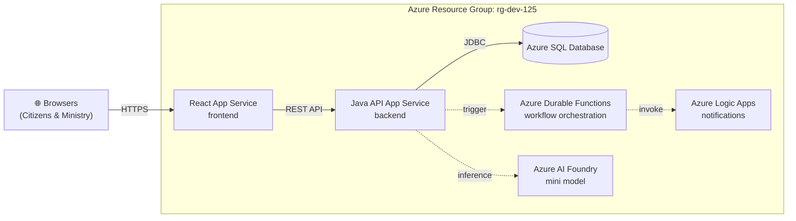
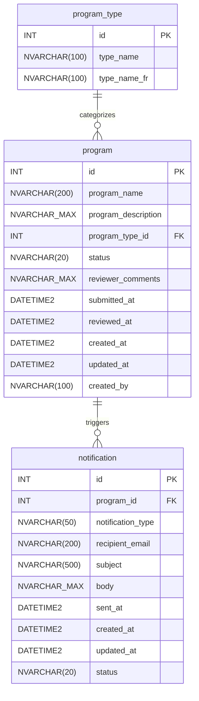

<!-- markdownlint-disable-file -->
# Task Research: Demo Scaffolding

Research everything needed to scaffold the OPS Program Approval demo application — a 130-minute Developer Day 2026 demo showcasing GitHub Copilot building a full-stack Program Approval web application from scratch for the Ontario Public Sector.

## Task Implementation Requests

* Produce a comprehensive research document covering all 13 scaffolding files (7 configuration + 3 documentation + 2 scripts + TALK-TRACK.md)
* Document Copilot instructions specifications for all instruction files
* Document MCP configuration for Azure DevOps integration
* Document ADO work item creation plan (Epic → Features → Stories)
* Document architecture, data dictionary, and design document specifications
* Document 130-minute talk track structure
* Document local development scripts
* Document `.gitignore` rules

## Scope and Success Criteria

* Scope: All 13 scaffolding files needed before any application code is written. Excludes document upload, `.devcontainer`, Azure Durable Functions code, Logic Apps connectors, AI Foundry integration code, and CD deployment workflow.
* Assumptions:
  * Only `README.md` and `.github/prompts/demo-scaffolding.prompt.md` exist in the repository
  * Azure resources are pre-deployed in resource group `rg-dev-125`
  * ADO organization is `MngEnvMCAP675646`, project is `ProgramDemo-DevDay2026-DryRun2`
  * All ADO work items must be created via MCP during the live demo (Act 1)
* Success Criteria:
  * Research document is detailed enough that `/task-plan` can produce a file-by-file implementation plan for all 13 files
  * Every convention, standard, pattern, and content requirement is documented with no ambiguity
  * No follow-up questions needed during implementation planning

## Outline

1. [Configuration Layer (7 Files)](#1-configuration-layer-7-files)
2. [Documentation Layer (3 Files)](#2-documentation-layer-3-files)
3. [Operational Layer (3 Files)](#3-operational-layer-3-files)
4. [ADO Work Item Creation Plan](#4-ado-work-item-creation-plan)
5. [Key Discoveries](#key-discoveries)
6. [Technical Scenarios](#technical-scenarios)
7. [Potential Next Research](#potential-next-research)

---

## 1. Configuration Layer (7 Files)

### 1.1 `.gitignore`

Combined Java + Node + IDE + OS rules. Use comment headers for readability.

```gitignore
# === Java / Maven ===
target/
*.class
*.jar
*.war
*.ear
!**/src/main/**/build/
!**/src/test/**/build/
*.log
hs_err_pid*
replay_pid*
.mvn/timing.properties
.mvn/wrapper/maven-wrapper.jar

# === Node / Vite ===
node_modules/
dist/
.env
.env.local
.env.*.local
*.local
coverage/
.eslintcache

# === IDE ===
.idea/
*.iml
*.iws
*.ipr
.vscode/settings.json
.vscode/launch.json
.project
.classpath
.settings/
.factorypath
*.swp
*~

# === OS ===
.DS_Store
Thumbs.db
desktop.ini
ehthumbs.db
```

**Key decisions:**

* `.vscode/mcp.json` must NOT be ignored — it is shared project configuration
* Maven wrapper scripts (`mvnw`, `mvnw.cmd`) should be committed; only the downloaded JAR is ignored
* `*.local` covers Vite local-only config files
* `replay_pid*` covers Java 21+ JVM replay files

---

### 1.2 `.vscode/mcp.json`

**Key discovery:** The prompt references `azure-devops-mcp` (community, read-only), but the official Microsoft package `@azure-devops/mcp` v2.4.0 provides full CRUD, browser-based auth (no PAT), and 9 selectable domains. **However**, the prompt explicitly specifies the command/args — use them as specified.

```json
{
  "servers": {
    "ado": {
      "type": "stdio",
      "command": "npx",
      "args": ["-y", "azure-devops-mcp", "--organization", "MngEnvMCAP675646", "--project", "ProgramDemo-DevDay2026-DryRun2"]
    }
  }
}
```

**Schema notes:**

* `type`: Always `"stdio"` for MCP servers
* `command`: The executable (`npx`)
* `args`: Array of CLI arguments
* Optional fields: `env` (environment variables), `cwd` (working directory)
* Node.js 20+ required for `npx`

---

### 1.3 `.github/copilot-instructions.md`

Global Copilot context file — applies to every interaction automatically. No `applyTo` frontmatter.

**Required content elements:**

| Element | Detail |
|---------|--------|
| Project overview | OPS Program Approval System for Developer Day 2026 |
| Tech stack table | React 18 + TS (frontend), Java 21 + Spring Boot 3.x (backend), Azure SQL (database) |
| Bilingual EN/FR | All user-facing text via i18next with `en.json`/`fr.json` |
| WCAG 2.2 Level AA | Semantic HTML, aria attributes, keyboard nav, 4.5:1 contrast, `lang` attribute |
| Ontario Design System | Use ontario-design-system CSS classes |
| Commit format | `AB#{id} <description>` |
| Branch naming | `feature/{id}-description` |
| PR linking | `Fixes AB#{id}` in PR description body |
| Project structure | `frontend/`, `backend/`, `database/` |
| ADO MCP reference | "This project uses Azure DevOps. Always check to see if the Azure DevOps MCP server has a tool relevant to the user's request." |

**Best practices:** Keep under 2000 tokens. Reference domain-specific `.instructions.md` files rather than duplicating content. No code examples (those belong in stack-specific files).

---

### 1.4 `.github/instructions/ado-workflow.instructions.md`

**Frontmatter:**

```yaml
---
description: "Azure DevOps workflow conventions for branching, commits, and pull requests"
applyTo: '**'
---
```

**Required content:**

| Convention | Pattern | Effect |
|------------|---------|--------|
| Branch naming | `feature/{id}-description` | Informational (no auto-linking) |
| Commit message | `AB#{id} <description>` | Links commit to ADO work item |
| PR description | `Fixes AB#{id}` | Links PR and transitions work item to Done on merge |
| Post-merge | Delete feature branch | Clean repository |
| Commit style | Imperative mood, ≤72 char subject | Git best practice |

**Pitfall:** `AB#` syntax requires Azure Boards GitHub integration to be configured in the ADO project settings.

---

### 1.5 `.github/instructions/java.instructions.md`

**Frontmatter:** `applyTo: 'backend/**'`

**Conventions:**

| Area | Convention |
|------|-----------|
| Java version | Java 21 (records for DTOs, pattern matching, text blocks) |
| Framework | Spring Boot 3.x with Spring Data JPA |
| Base package | `com.ontario.program` |
| Injection | Constructor injection only (no `@Autowired` on fields) |
| Validation | `@Valid` + Bean Validation (`@NotBlank`, `@NotNull`, `@Size`, `@Pattern`) |
| Return types | `ResponseEntity` from all controller methods |
| Error handling | `ProblemDetail` (RFC 7807) via `@RestControllerAdvice` |
| Database dev | H2 with `MODE=MSSQLServer` in `local` profile |
| Migrations | Flyway in `src/main/resources/db/migration/` |
| DDL auto | `validate` (never `update` or `create-drop` with Flyway) |

**Project structure:**

```text
backend/src/main/java/com/ontario/program/
├── ProgramApplication.java
├── config/
├── controller/
├── dto/
├── exception/
├── model/
├── repository/
└── service/
```

**H2 local profile (`application-local.yml`):**

```yaml
spring:
  datasource:
    url: jdbc:h2:mem:programdb;MODE=MSSQLServer;DATABASE_TO_LOWER=TRUE
    driver-class-name: org.h2.Driver
    username: sa
    password:
  h2:
    console:
      enabled: true
  jpa:
    hibernate:
      ddl-auto: validate
  flyway:
    enabled: true
```

**ProblemDetail:** Enable via `spring.mvc.problemdetails.enabled: true` or explicit `@ExceptionHandler` in `@RestControllerAdvice`.

**Pitfalls:**

* `@NotBlank` only works on `CharSequence` types — use `@NotNull` for `Integer` fields like `programTypeId`
* H2 `MODE=MSSQLServer` does not support `sys.tables`/`sys.columns` views
* Base package must be at or above `@SpringBootApplication` for component scanning

---

### 1.6 `.github/instructions/react.instructions.md`

**Frontmatter:** `applyTo: 'frontend/**'`

**Conventions:**

| Area | Convention |
|------|-----------|
| Framework | React 18 + TypeScript strict mode |
| Build tool | Vite with `server.port: 3000` |
| Components | Functional components with hooks only |
| i18n | i18next with `en.json`/`fr.json`, `react-i18next`, `i18next-browser-languagedetector` |
| Design system | Ontario Design System CSS classes (`@ongov/ontario-design-system-global-styles`) |
| Accessibility | WCAG 2.2 Level AA |
| Routing | `react-router-dom` v6 |
| HTTP client | axios with centralized API client |
| Exports | Named exports (not default) |
| `lang` attribute | Set dynamically on `<html>` based on selected language |

**Ontario DS CSS classes:**

| Component | CSS Class |
|-----------|----------|
| Page container | `ontario-page__container` |
| Header | `ontario-header` |
| Footer | `ontario-footer` |
| Primary button | `ontario-button ontario-button--primary` |
| Secondary button | `ontario-button ontario-button--secondary` |
| Form input | `ontario-input` |
| Form label | `ontario-label` |
| Form group | `ontario-form-group` |
| Select dropdown | `ontario-select` |
| Textarea | `ontario-textarea` |
| Error message | `ontario-input__error` |
| Alert (info) | `ontario-alert ontario-alert--informational` |
| Alert (error) | `ontario-alert ontario-alert--error` |
| Alert (success) | `ontario-alert ontario-alert--success` |

**i18next configuration:**

```typescript
import i18n from 'i18next';
import { initReactI18next } from 'react-i18next';
import LanguageDetector from 'i18next-browser-languagedetector';
import en from './locales/en.json';
import fr from './locales/fr.json';

i18n
  .use(LanguageDetector)
  .use(initReactI18next)
  .init({
    resources: {
      en: { translation: en },
      fr: { translation: fr }
    },
    fallbackLng: 'en',
    supportedLngs: ['en', 'fr'],
    interpolation: { escapeValue: false }
  });
```

**WCAG 2.2 Level AA key criteria:**

| Criterion | ID | Requirement |
|-----------|----|-------------|
| Non-text Content | 1.1.1 | All images have alt text |
| Info and Relationships | 1.3.1 | Form fields linked to labels with `htmlFor`/`id` |
| Contrast (Minimum) | 1.4.3 | 4.5:1 for normal text, 3:1 for large text |
| Keyboard | 2.1.1 | All functionality operable via keyboard |
| Focus Visible | 2.4.7 | Keyboard focus indicator visible |
| Language of Page | 3.1.1 | `lang` attribute on `<html>` |
| Error Identification | 3.3.1 | Errors described in text (not just color) |
| Focus Not Obscured | 2.4.11 | Focused element not hidden (new in 2.2) |

**Vite config with API proxy:**

```typescript
export default defineConfig({
  plugins: [react()],
  server: {
    port: 3000,
    proxy: {
      '/api': { target: 'http://localhost:8080', changeOrigin: true }
    }
  }
});
```

**Pitfalls:**

* Hardcoding English strings bypasses i18next and breaks French
* Using `div` with `onClick` instead of `button` breaks keyboard accessibility
* Ontario DS CSS may conflict with other CSS resets — load it before app styles

---

### 1.7 `.github/instructions/sql.instructions.md`

**Frontmatter:** `applyTo: 'database/**'`

**Conventions:**

| Area | Convention |
|------|-----------|
| Target | Azure SQL (H2 locally with `MODE=MSSQLServer`) |
| Migrations | Flyway versioned: `V001__description.sql` |
| Text columns | `NVARCHAR` (Unicode for EN/FR) |
| Primary keys | `INT IDENTITY(1,1)` |
| Timestamps | `DATETIME2` |
| DDL guards | `IF NOT EXISTS` on CREATE TABLE and ALTER TABLE |
| Seed data | `INSERT ... WHERE NOT EXISTS` (never MERGE) |
| Audit columns | `created_at`, `updated_at`, `created_by` where applicable |
| Naming | `PK_tablename`, `FK_tablename_reference` |
| Rule | One logical change per migration file; never modify applied migrations |

**Why avoid MERGE:** SQL Server MERGE has documented concurrency bugs (data corruption under load). `INSERT ... WHERE NOT EXISTS` is idempotent, bug-free, and works identically on H2 and Azure SQL.

**H2 compatibility:** Supports `IDENTITY(1,1)`, `NVARCHAR`, `DATETIME2`, `GETDATE()`. Does NOT support `sys.tables`/`sys.columns` (use `INFORMATION_SCHEMA` or rely on Flyway versioning).

---

## 2. Documentation Layer (3 Files)

### 2.1 `docs/architecture.md`

**Diagram type:** Mermaid `flowchart LR` with `subgraph` (preferred over C4 — universal rendering, audience-scannable, simpler syntax).

**Mermaid diagram:**



**Note:** Dashed lines (`-.->`) for stretch-goal services (Durable Functions, Logic Apps, AI Foundry) to distinguish from core data flow.

**File structure:**

```markdown
---
title: "Architecture"
description: "High-level system architecture for the OPS Program Approval application deployed to Azure resource group rg-dev-125"
---

# Architecture
## Overview (narrative paragraph)
## System Diagram (Mermaid flowchart)
## Azure Resources (table: Resource, Type, Purpose)
## Data Flow (numbered steps)
```

---

### 2.2 `docs/data-dictionary.md`

**Mermaid ER diagram:**



**Note:** Use `NVARCHAR_MAX` (underscore) in Mermaid ER to avoid parenthesis parsing issues. Document actual type as `NVARCHAR(MAX)` in column tables.

**Column specifications:**

#### `program_type` (lookup — no audit columns)

| Column | Type | Constraints | Description |
|--------|------|-------------|-------------|
| `id` | `INT IDENTITY(1,1)` | `PRIMARY KEY` | Auto-incremented identifier |
| `type_name` | `NVARCHAR(100)` | `NOT NULL` | English name |
| `type_name_fr` | `NVARCHAR(100)` | `NOT NULL` | French name |

#### `program` (core entity — with audit columns)

| Column | Type | Constraints | Description |
|--------|------|-------------|-------------|
| `id` | `INT IDENTITY(1,1)` | `PRIMARY KEY` | Auto-incremented identifier |
| `program_name` | `NVARCHAR(200)` | `NOT NULL` | Name of the submitted program |
| `program_description` | `NVARCHAR(MAX)` | `NOT NULL` | Free-text description |
| `program_type_id` | `INT` | `FK → program_type.id`, `NOT NULL` | Links to program type lookup |
| `status` | `NVARCHAR(20)` | `NOT NULL`, `DEFAULT 'DRAFT'` | Workflow status |
| `reviewer_comments` | `NVARCHAR(MAX)` | `NULL` | Reviewer comments |
| `submitted_at` | `DATETIME2` | `NULL` | Submission timestamp |
| `reviewed_at` | `DATETIME2` | `NULL` | Review timestamp |
| `created_at` | `DATETIME2` | `NOT NULL`, `DEFAULT GETDATE()` | Record creation |
| `updated_at` | `DATETIME2` | `NOT NULL`, `DEFAULT GETDATE()` | Last update |
| `created_by` | `NVARCHAR(100)` | `NULL` | User who created the record |

**Status lifecycle:** `DRAFT` → `SUBMITTED` → `APPROVED` or `REJECTED`

* `POST /api/programs` sets status to `SUBMITTED` explicitly (overrides DB default `DRAFT`)
* `PUT /api/programs/{id}/review` sets `APPROVED` or `REJECTED`

#### `notification` (system-generated — no `created_by`)

| Column | Type | Constraints | Description |
|--------|------|-------------|-------------|
| `id` | `INT IDENTITY(1,1)` | `PRIMARY KEY` | Auto-incremented identifier |
| `program_id` | `INT` | `FK → program.id`, `NOT NULL` | Linked program |
| `notification_type` | `NVARCHAR(50)` | `NOT NULL` | Type: `SUBMISSION_RECEIVED`, `APPROVED`, `REJECTED` |
| `recipient_email` | `NVARCHAR(200)` | `NOT NULL` | Recipient email |
| `subject` | `NVARCHAR(500)` | `NOT NULL` | Email subject |
| `body` | `NVARCHAR(MAX)` | `NOT NULL` | Email body |
| `sent_at` | `DATETIME2` | `NULL` | When notification was sent |
| `created_at` | `DATETIME2` | `NOT NULL`, `DEFAULT GETDATE()` | Record creation |
| `updated_at` | `DATETIME2` | `NOT NULL`, `DEFAULT GETDATE()` | Last update |
| `status` | `NVARCHAR(20)` | `NOT NULL`, `DEFAULT 'PENDING'` | Delivery status: `PENDING`, `SENT`, `FAILED` |

**Seed data — 5 program types:**

| id | type_name (EN) | type_name_fr (FR) |
|----|----------------|-------------------|
| 1 | Community Services | Services communautaires |
| 2 | Health & Wellness | Santé et bien-être |
| 3 | Education & Training | Éducation et formation |
| 4 | Environment & Conservation | Environnement et conservation |
| 5 | Economic Development | Développement économique |

**Seed insertion pattern:**

```sql
INSERT INTO program_type (type_name, type_name_fr)
SELECT N'Community Services', N'Services communautaires'
WHERE NOT EXISTS (
    SELECT 1 FROM program_type WHERE type_name = N'Community Services'
);
```

---

### 2.3 `docs/design-document.md`

#### API Endpoints

**1. `POST /api/programs` — Submit a program**

| Property | Value |
|----------|-------|
| Status codes | `201 Created`, `400 Bad Request` (validation), `500` |
| Request body | `ProgramSubmitRequest` |
| Response body | `ProgramResponse` |

**2. `GET /api/programs` — List all programs**

| Property | Value |
|----------|-------|
| Status codes | `200 OK` |
| Query params | `status` (optional), `search` (optional) |
| Response body | `ProgramResponse[]` |

**3. `GET /api/programs/{id}` — Get single program**

| Property | Value |
|----------|-------|
| Status codes | `200 OK`, `404 Not Found` |
| Response body | `ProgramResponse` |

**4. `PUT /api/programs/{id}/review` — Approve or reject**

| Property | Value |
|----------|-------|
| Status codes | `200 OK`, `400 Bad Request`, `404 Not Found`, `409 Conflict` |
| Request body | `ProgramReviewRequest` |
| Response body | `ProgramResponse` |

* 409 Conflict: program not in `SUBMITTED` status (already reviewed)

**5. `GET /api/program-types` — Dropdown values**

| Property | Value |
|----------|-------|
| Status codes | `200 OK` |
| Response body | `ProgramTypeResponse[]` |

#### Request DTOs with Bean Validation

```java
public record ProgramSubmitRequest(
    @NotBlank @Size(max = 200) String programName,
    @NotBlank String programDescription,
    @NotNull Integer programTypeId,
    @Size(max = 100) String createdBy
) {}

public record ProgramReviewRequest(
    @NotBlank @Pattern(regexp = "APPROVED|REJECTED") String status,
    @Size(max = 4000) String reviewerComments
) {}
```

#### Response DTOs

```java
public record ProgramResponse(
    Integer id, String programName, String programDescription,
    Integer programTypeId, String programTypeName, String programTypeNameFr,
    String status, String reviewerComments,
    LocalDateTime submittedAt, LocalDateTime reviewedAt,
    LocalDateTime createdAt, LocalDateTime updatedAt, String createdBy
) {}

public record ProgramTypeResponse(
    Integer id, String typeName, String typeNameFr
) {}
```

* Response includes both EN/FR type names — frontend selects language client-side via i18next

#### RFC 7807 ProblemDetail Error Format

```json
{
  "type": "about:blank",
  "title": "Bad Request",
  "status": 400,
  "detail": "Validation failed",
  "instance": "/api/programs"
}
```

Additional examples: `404 Not Found` ("Program not found with id: 99"), `409 Conflict` ("Program with id 1 has already been reviewed").

#### Frontend Component Hierarchy

```text
App
└── Layout
    ├── Header
    │   └── LanguageToggle
    ├── Footer
    └── <Router Outlet>
        ├── SubmitProgram          /submit
        ├── SubmitConfirmation     /submit/confirmation
        ├── SearchPrograms         /search
        ├── ReviewDashboard        /review
        └── ReviewDetail           /review/:id
```

| Component | Route | Purpose |
|-----------|-------|---------|
| `SubmitProgram` | `/submit` | Program submission form; validates and calls `POST /api/programs` |
| `SubmitConfirmation` | `/submit/confirmation` | Confirmation page with program ID and status |
| `SearchPrograms` | `/search` | Search/list programs; calls `GET /api/programs` |
| `ReviewDashboard` | `/review` | Ministry dashboard; lists SUBMITTED programs |
| `ReviewDetail` | `/review/:id` | Review page with approve/reject; calls `PUT /api/programs/{id}/review` |
| `LanguageToggle` | — | EN/FR switcher; calls `i18next.changeLanguage()` and sets `<html lang="">` |

---

## 3. Operational Layer (3 Files)

### 3.1 `TALK-TRACK.md` (repository root)

130-minute minute-by-minute demo script.

**Part 1: "Building From Zero" (Minutes 0–70)**

| Minutes | Act | Role | Content |
|---------|-----|------|---------|
| 0–8 | Opening | Presenter | Show empty repo, Azure portal (`rg-dev-125`), empty ADO board |
| 8–20 | Act 1: The Architect | Architect | Run scaffolding prompts, configure MCP, create ADO Epic/Features/Stories via MCP |
| 20–32 | Act 2: The DBA | DBA | 4 Flyway SQL migrations: program_type, program, notification, seed data |
| 32–52 | Act 3: The Backend Developer | Backend Dev | Spring Boot scaffolding + 5 API endpoints + live curl tests |
| 52–70 | Act 4: The Frontend Developer | Frontend Dev | React + Ontario DS + bilingual citizen portal + live form submission |

**Cliffhanger (Minute 70):** Citizen can submit programs but Ministry Portal is empty. ADO board shows 3 Ministry Portal stories still in "New".

**Part 2: "Closing the Loop" (Minutes 70–130)**

| Minutes | Act | Role | Content |
|---------|-----|------|---------|
| 70–73 | Recap | Presenter | Quick recap, show database with submissions |
| 73–87 | Act 5: Completing the Story | Frontend Dev | Ministry review dashboard, detail, approve/reject |
| 87–100 | Act 6: The QA Engineer | QA | Backend controller tests, frontend component tests, accessibility |
| 100–107 | Act 7: The DevOps Engineer | DevOps | CI pipeline, Dependabot, secret scanning, GHAS |
| 107–120 | Act 8: The Full Stack Change | Full Stack | Add `program_budget`: migration → entity → DTO → API → form → tests |
| 120–130 | Closing | Presenter | Summary stats, ADO board all done, Q&A |

**9 Tagged Checkpoints:**

| Tag | Checkpoint | Contents | Minute |
|-----|-----------|----------|--------|
| `v0.1.0` | Scaffolding Complete | 13 scaffolding files, ADO work items | ~20 |
| `v0.2.0` | Database Ready | 4 Flyway migrations applied to H2 | ~32 |
| `v0.3.0` | API Running | Spring Boot + 5 endpoints + passing curl tests | ~52 |
| `v0.4.0` | Citizen Portal Live | React + Ontario DS + bilingual + form submission | ~70 |
| `v0.5.0` | Ministry Portal Complete | Review dashboard + detail + approve/reject | ~87 |
| `v0.6.0` | Tests Passing | Backend + frontend + accessibility tests | ~100 |
| `v0.7.0` | CI/CD Ready | GitHub Actions CI, Dependabot, secret scanning | ~107 |
| `v0.8.0` | Budget Field Added | `program_budget` end-to-end | ~120 |
| `v1.0.0` | Demo Complete | All features, tests, CI complete | ~130 |

**Formatting requirements:**

* Scripted dialogue in blockquotes (`> "What to say"`)
* Demo actions as bullet lists with `[Minute XX]` markers
* `Key beat:` callouts for critical impact moments
* `Audience engagement point:` callouts for natural pause points
* Expected output after each action for presenter confirmation

**Recovery decision matrix:**

| Situation | Time Lost | Action |
|-----------|-----------|--------|
| Copilot generates wrong code | < 2 min | Fix manually, continue |
| Copilot generates wrong code | 2–5 min | Retry once, then fast-forward |
| Build/compile error | > 2 min | Fast-forward to checkpoint |
| Azure connectivity lost | Any | Switch to H2 local, continue |
| Total overrun > 10 min | — | Skip Act 6 (QA) or Act 7 (DevOps) |

**Key numbers summary table (estimated — update after dry run):**

| Metric | Count |
|--------|-------|
| Total demo duration | 130 minutes |
| Lines of Java code | ~500 |
| Lines of TypeScript/React code | ~800 |
| Lines of SQL | ~100 |
| API endpoints | 5 |
| Database tables | 3 |
| Flyway migrations | 4 (+1 for budget) |
| React pages/components | ~10 |
| ADO work items created | 36 |
| Git commits | ~20 |
| Tagged checkpoints | 9 |
| Languages supported | 2 (EN/FR) |
| CI workflows | 1 |
| Security tools | 3 (Dependabot, Secret Scanning, GHAS) |

---

### 3.2 `scripts/Start-Local.ps1`

**Parameters:**

```powershell
param(
    [switch]$SkipBuild,
    [switch]$BackendOnly,
    [switch]$FrontendOnly,
    [switch]$UseAzureSql
)
```

**Behavior:**

| Parameter | Effect |
|-----------|--------|
| _(none)_ | Start both backend and frontend |
| `-SkipBuild` | Skip Maven package and npm install |
| `-BackendOnly` | Start only Spring Boot (port 8080) |
| `-FrontendOnly` | Start only Vite (port 3000) |
| `-UseAzureSql` | Use `azure` Spring profile instead of `local` (H2) |

**Implementation approach:** `Start-Process` (each service in its own terminal window). Simpler than background jobs, visually clear for demo, cleanup via `Stop-Local.ps1`.

**Key features:**

* Comment-based help (`.SYNOPSIS`, `.DESCRIPTION`, `.PARAMETER`, `.EXAMPLE`)
* Prerequisite checks (java, node/npm existence)
* `-UseAzureSql` validates `AZURE_SQL_URL`, `AZURE_SQL_USERNAME`, `AZURE_SQL_PASSWORD` env vars
* Mutual exclusion: error if both `-BackendOnly` and `-FrontendOnly`
* Maven wrapper: `.\mvnw.cmd` on Windows
* Spring profile: `SPRING_PROFILES_ACTIVE` set to `local` or `azure`
* Summary output with URLs after startup

---

### 3.3 `scripts/Stop-Local.ps1`

Uses `Get-NetTCPConnection` to find and kill processes on ports 8080 and 3000.

**Implementation:**

```powershell
function Stop-ProcessOnPort {
    param([int]$Port, [string]$ServiceName)
    $connections = Get-NetTCPConnection -LocalPort $Port -State Listen -ErrorAction SilentlyContinue
    if (-not $connections) {
        Write-Host "[$ServiceName] No process found on port $Port." -ForegroundColor DarkGray
        return
    }
    $pids = $connections | Select-Object -ExpandProperty OwningProcess -Unique
    foreach ($processId in $pids) {
        $proc = Get-Process -Id $processId -ErrorAction SilentlyContinue
        if ($proc) {
            Write-Host "[$ServiceName] Stopping $($proc.ProcessName) (PID: $processId)..." -ForegroundColor Yellow
            Stop-Process -Id $processId -Force
        }
    }
}

Stop-ProcessOnPort -Port 8080 -ServiceName "Backend"
Stop-ProcessOnPort -Port 3000 -ServiceName "Frontend"
```

**Key decisions:**

* `-Force` for instant cleanup (appropriate for demo context)
* `-ErrorAction SilentlyContinue` handles "no process on port" gracefully
* `Select-Object -Unique` avoids killing same PID twice (IPv4 + IPv6 listeners)
* Windows-only (cross-platform is out of scope)

---

## 4. ADO Work Item Creation Plan

### Hierarchy: 1 Epic + 8 Features + 27 Stories = 36 items

Created top-down during Act 1 (minutes 8–20) via MCP.

#### Epic

| Type | Title | Initial State |
|------|-------|---------------|
| Epic | OPS Program Approval System | New |

#### Features

| Type | Title | Initial State | Notes |
|------|-------|---------------|-------|
| Feature | Infrastructure Setup | New → **Closed** | Pre-deployed in `rg-dev-125`; close immediately |
| Feature | Database Layer | New | |
| Feature | Backend API | New | |
| Feature | Citizen Portal | New | |
| Feature | Ministry Portal | New | Unstarted at cliffhanger (minute 70) |
| Feature | Quality Assurance | New | |
| Feature | CI/CD Pipeline | New | |
| Feature | Live Change Demo | New | |

#### Stories by Feature

**Database Layer (4):** Create program_type table, Create program table, Create notification table, Insert seed data

**Backend API (5):** Spring Boot project scaffolding, Submit program endpoint (POST /api/programs), List and get program endpoints (GET /api/programs, GET /api/programs/{id}), Review program endpoint (PUT /api/programs/{id}/review), Program types endpoint (GET /api/program-types)

**Citizen Portal (6):** React project scaffolding with Vite, Ontario DS layout (Header, Footer, LanguageToggle), Program submission form, Submission confirmation page, Program search page, Bilingual EN/FR support with i18next

**Ministry Portal (3):** Review dashboard page, Review detail page, Approve/reject actions

**Quality Assurance (4):** Backend controller tests, Frontend component tests, Accessibility tests, Bilingual verification

**CI/CD Pipeline (3):** CI workflow (GitHub Actions), Dependabot config, Secret scanning

**Live Change Demo (2):** Add program_budget field end-to-end, Update tests for new field

### Timing Analysis

12 minutes for 36 items is tight but feasible with batching (one prompt per Feature group). Recovery: create Epic + Features live (~3 min), fast-forward to pre-populated board for Stories if MCP is slow.

### State Transitions During Demo

* Act start → set Feature to Active
* Story completion → set Story to Closed
* Minute 70 cliffhanger → Ministry Portal stories visually "New" on ADO board
* Minute 130 → all items Closed

---

## Key Discoveries

| # | Discovery | Impact |
|---|-----------|--------|
| 1 | Official MCP package is `@azure-devops/mcp` (Microsoft, full CRUD), but prompt specifies `azure-devops-mcp` | Use prompt-specified package |
| 2 | `@NotBlank` only works on `CharSequence` — use `@NotNull` for `Integer` fields | Critical for `programTypeId` validation |
| 3 | Spring Boot `ProblemDetail` requires explicit enablement: `spring.mvc.problemdetails.enabled: true` | Must document in java.instructions.md |
| 4 | `NVARCHAR(MAX)` → `NVARCHAR_MAX` in Mermaid ER to avoid parsing issues | Underscore notation in diagrams |
| 5 | SQL Server `MERGE` has documented concurrency bugs | `INSERT...WHERE NOT EXISTS` is the safe pattern |
| 6 | H2 `MODE=MSSQLServer` does not support `sys.tables`/`sys.columns` | Use Flyway versioning instead of runtime guards |
| 7 | `POST /api/programs` sets status to `SUBMITTED` (overrides DB default `DRAFT`) | Document this explicitly |
| 8 | 409 Conflict for already-reviewed programs prevents double-approval | Standard HTTP idiom |
| 9 | Response DTOs include both EN/FR type names to avoid extra API call | Frontend selects language client-side |
| 10 | 36 ADO work items total (1 Epic + 8 Features + 27 Stories), not ~30 | Affects Act 1 timing |
| 11 | Flowchart preferred over C4 for architecture diagram | Universal Mermaid rendering support |
| 12 | WCAG 2.2 adds Focus Not Obscured (2.4.11) and Dragging Movements (2.5.7) over 2.1 | Relevant for form-heavy government apps |
| 13 | Ontario DS available as `@ongov/ontario-design-system-global-styles` npm package | Include in react.instructions.md |
| 14 | `notification.created_at` should have `DEFAULT GETDATE()` for consistency | Add default to match `updated_at` |

---

## Technical Scenarios

### Scenario: MCP Package Selection

**Requirements:** Full CRUD for ADO work items during live demo

**Preferred Approach:** Use the command specified in the prompt (`azure-devops-mcp`) exactly as documented, since the demo prompt is the single source of truth. The official `@azure-devops/mcp` package is noted as an alternative for future consideration.

```json
{
  "servers": {
    "ado": {
      "type": "stdio",
      "command": "npx",
      "args": ["-y", "azure-devops-mcp", "--organization", "MngEnvMCAP675646", "--project", "ProgramDemo-DevDay2026-DryRun2"]
    }
  }
}
```

#### Considered Alternatives

* **`@azure-devops/mcp` (Microsoft official):** Full CRUD, browser-based auth, 9 domains. Superior capabilities but not what the prompt specifies. Could be adopted if the community package proves insufficient.

### Scenario: Architecture Diagram Type

**Requirements:** Visual representation of system components in Mermaid

**Preferred Approach:** `flowchart LR` with `subgraph` for resource group boundary. Universal rendering across GitHub, VS Code, and all Mermaid viewers. Dashed lines for stretch-goal services.

#### Considered Alternatives

* **Mermaid C4 diagrams:** More semantically rich but still experimental in some renderers. Rejected for demo reliability.

### Scenario: Local Dev Script Process Management

**Requirements:** Run backend and frontend simultaneously from a single script

**Preferred Approach:** `Start-Process` — each service in its own terminal window. Simple, visual, demo-friendly. `Stop-Local.ps1` handles cleanup.

#### Considered Alternatives

* **PowerShell Background Jobs (`Start-Job`):** Single terminal, Ctrl+C cleanup. More complex, `$using:` scope rules. Rejected for demo simplicity.
* **`docker-compose`:** Requires Docker Desktop. Out of scope per requirements.

---

## Potential Next Research

| Topic | Priority | Reasoning |
|-------|----------|-----------|
| Azure DevOps MCP authentication flow (PAT vs. OAuth) | High | Need to verify auth works on demo machine |
| Exact Copilot prompts for reliable MCP work item batching | High | Critical for Act 1 timing |
| Pre-demo preparation automation script | Medium | Verify all prerequisites before going live |
| Ontario Design System npm version and Vite integration | Medium | Confirm CSS import path |
| `.devcontainer/devcontainer.json` for Java 21 + Node 20 | Low | Out of scope but referenced in README |
| GitHub Actions CI workflow for dual-stack builds | Low | Covered in Act 7 |

---

## Research Executed

### File Analysis

* [README.md](README.md) (lines 1–180): Business context, tech stack, demo flow, application screens, lessons learned
* [.github/prompts/demo-scaffolding.prompt.md](.github/prompts/demo-scaffolding.prompt.md) (lines 1–262): Full scaffolding specification with all 13 files, content requirements, and success criteria

### Project Conventions

* Standards referenced: Ontario Design System, WCAG 2.2 Level AA, RFC 7807 (Problem Details), Flyway migrations, Azure SQL
* Instructions followed: README.md business context and lessons learned, demo-scaffolding.prompt.md specifications

### Subagent Research Documents

* [Configuration layer](.copilot-tracking/research/subagents/2026-03-02/configuration-layer-research.md) — 1005 lines covering all 7 configuration files
* [Documentation layer](.copilot-tracking/research/subagents/2026-03-02/documentation-layer-research.md) — 1076 lines covering architecture, data dictionary, design document
* [Operational layer](.copilot-tracking/research/subagents/2026-03-02/operational-layer-research.md) — 1137 lines covering talk track, scripts, ADO work items
