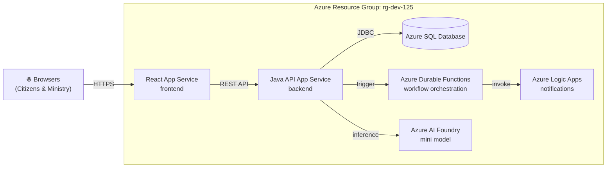
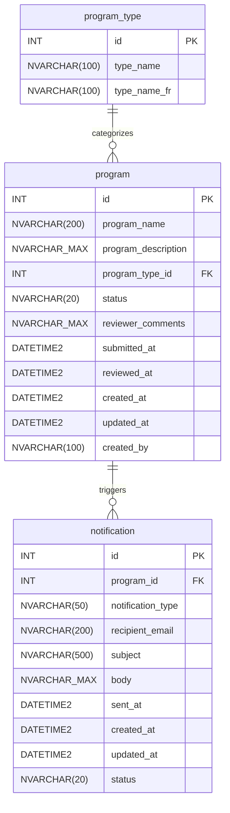
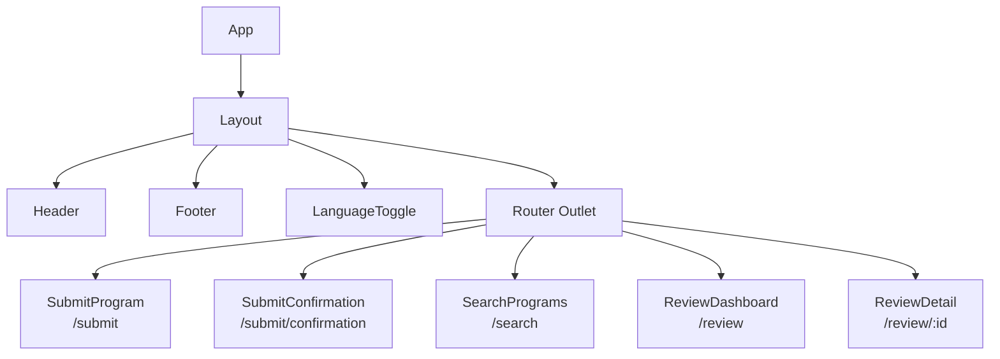

# Documentation Layer Research

Subagent research covering the three documentation-layer files for the OPS Program Approval demo scaffolding: `docs/architecture.md`, `docs/data-dictionary.md`, and `docs/design-document.md`.

---

## 1. `docs/architecture.md`

### 1.1 Content Specification

The architecture document must contain:

- Valid YAML frontmatter with `title` and `description`
- A brief narrative overview of the system architecture
- A Mermaid diagram showing all major components and their data flow
- A table listing Azure resources in resource group `rg-dev-125`
- Notes on future/stretch-goal services (Durable Functions, Logic Apps, AI Foundry)

### 1.2 Mermaid Diagram Research: C4 vs Flowchart

#### C4 Diagrams in Mermaid

Mermaid supports C4 diagrams via the `C4Context`, `C4Container`, and `C4Deployment` diagram types. The syntax uses directives like `Person()`, `System()`, `Container()`, `System_Ext()`, `Rel()`, and `Boundary()`.

**Pros for this use case:**

- Semantically rich — clearly distinguishes persons, systems, containers, and boundaries
- Industry-standard architectural notation (Simon Brown's C4 model)
- `Boundary()` can represent the Azure resource group `rg-dev-125`
- Cleanly separates external actors (browsers/citizens) from internal services

**Cons for this use case:**

- Mermaid C4 support is still experimental in some renderers (GitHub renders it, but some VS Code extensions may not)
- Verbose syntax for a demo context — may be harder to read quickly on-screen
- Limited styling/layout control

#### Flowchart Diagrams in Mermaid

Standard `flowchart` (or `graph`) diagrams use `-->`, `subgraph`, and simple node definitions.

**Pros for this use case:**

- Universal Mermaid support in GitHub, VS Code, and all renderers
- Concise, easy-to-read syntax
- `subgraph` can represent the Azure resource group boundary
- Better for demo — audiences scan it quickly

**Cons for this use case:**

- Less semantically meaningful than C4 (nodes are just boxes, no Person/Container distinction)
- Doesn't enforce architectural layers

#### Recommendation: Flowchart (`flowchart LR`)

For a 130-minute live demo context, **flowchart is the better choice**:

1. **Universal rendering** — guaranteed to render on GitHub, VS Code preview, and any Mermaid viewer
2. **Readability** — audience can parse it in seconds during the demo
3. **Simplicity** — easier for Copilot to generate and maintain
4. **`subgraph`** — adequately represents the `rg-dev-125` boundary

### 1.3 Representing Azure Services in Mermaid

Since Mermaid doesn't support Azure-specific icons natively, represent services as labeled nodes with descriptive text:

| Azure Service | Mermaid Node ID | Label |
|---|---|---|
| React App Service | `react_app` | `React App Service<br/>frontend` |
| Java API App Service | `java_api` | `Java API App Service<br/>backend` |
| Azure SQL Database | `azure_sql` | `Azure SQL Database` |
| Durable Functions | `durable_func` | `Azure Durable Functions` |
| Logic Apps | `logic_apps` | `Azure Logic Apps` |
| AI Foundry | `ai_foundry` | `Azure AI Foundry<br/>mini model` |

### 1.4 Network and Security Boundaries

For the demo context, showing full network/security boundaries (NSGs, VNETs, private endpoints) is **out of scope**. The diagram should show:

- One `subgraph` for the Azure resource group `rg-dev-125`
- The public-facing entry point (browsers)
- Internal service communication arrows

This keeps the diagram clean while conveying the deployment topology.

### 1.5 Mermaid Diagram Code — Architecture



### 1.6 Complete File Structure for `docs/architecture.md`

```markdown
---
title: "Architecture"
description: "High-level system architecture for the OPS Program Approval application deployed to Azure resource group rg-dev-125"
---

# Architecture

## Overview

[Narrative paragraph describing the system]

## System Diagram

[Mermaid flowchart diagram]

## Azure Resources

| Resource | Type | Purpose |
|----------|------|---------|
| React frontend | App Service | Serves the React SPA to citizens and ministry users |
| Java API backend | App Service | REST API layer (Spring Boot 3.x, Java 21) |
| Database | Azure SQL | Persistent storage for programs, types, and notifications |
| Workflow engine | Durable Functions | Orchestrates multi-step approval workflows |
| Notifications | Logic Apps | Sends email notifications on status changes |
| AI model | AI Foundry | Mini model for content analysis (stretch goal) |

## Data Flow

1. Citizens and ministry employees access the application through their browsers.
2. The React SPA is served from an Azure App Service.
3. The SPA communicates with the Java API App Service via REST (HTTPS).
4. The Java API reads from and writes to Azure SQL via JDBC.
5. On program submission, the API triggers Azure Durable Functions for workflow orchestration.
6. Durable Functions invoke Logic Apps to send email notifications.
7. The API may call AI Foundry for content analysis (stretch goal).

## Resource Group

All resources are deployed to Azure resource group `rg-dev-125`.
```

### 1.7 Potential Pitfalls — Architecture

| Pitfall | Mitigation |
|---------|------------|
| C4 diagram doesn't render on all Mermaid viewers | Use standard `flowchart` instead |
| Emoji in node labels may not render in some contexts | Test on GitHub; emoji renders reliably on GitHub Markdown |
| Arrows become unreadable with too many services | Group related services; keep core data flow linear (browsers → React → API → SQL) with side branches for Durable Functions, Logic Apps, AI Foundry |
| Missing `rg-dev-125` reference | Use `subgraph` label to make it visually prominent |
| Audience confuses stretch-goal services with core path | Add a note or use dashed lines (`-.->`) for future/stretch services |

---

## 2. `docs/data-dictionary.md`

### 2.1 Content Specification

The data dictionary must contain:

- Valid YAML frontmatter with `title` and `description`
- A Mermaid ER diagram showing all 3 tables and their relationships
- Detailed column specification tables for each entity
- Seed data documentation (5 program types in EN/FR)
- Notes on conventions (NVARCHAR, DATETIME2, audit columns, identity PKs)

### 2.2 Mermaid ER Diagram Syntax Research

#### Basic Syntax

Mermaid ER diagrams use the `erDiagram` block type. Entities are defined with their attributes, and relationships use crow's foot notation:

```
erDiagram
    ENTITY_A ||--o{ ENTITY_B : "relationship_label"
    ENTITY_A {
        type name
        type name PK
        type name FK
    }
```

#### Relationship Notation

| Symbol | Meaning |
|--------|---------|
| `\|\|` | Exactly one |
| `o\|` | Zero or one |
| `}o` | Zero or many |
| `}\|` | One or many |
| `\|{` | One or many (reverse) |
| `o{` | Zero or many (reverse) |

For this schema:

- `program_type ||--o{ program` — one program type has zero or many programs
- `program ||--o{ notification` — one program has zero or many notifications

#### Handling NVARCHAR(MAX) in Mermaid ER

Mermaid ER attribute types are free-form text — they don't validate SQL types. However, some characters cause parsing issues:

- **Parentheses are supported**: `NVARCHAR(100)` renders correctly
- **`NVARCHAR(MAX)` works**: The text `MAX` inside parentheses is treated as a literal
- **Recommendation**: Use the exact SQL type notation for clarity: `NVARCHAR(MAX)`, `NVARCHAR(200)`, `INT`, `DATETIME2`

**Tested syntax example:**

```
erDiagram
    program {
        INT id PK
        NVARCHAR(200) program_name
        NVARCHAR_MAX program_description
    }
```

**Important caveat**: Some Mermaid renderers struggle with parentheses inside attribute types when there are also PK/FK markers on the same line. The safest approach is:

- Use `NVARCHAR_MAX` (underscore instead of parentheses) for `NVARCHAR(MAX)` columns, OR
- Use a simplified notation like `text` for MAX-length columns

**Recommendation for this project**: Use `NVARCHAR_MAX` for `NVARCHAR(MAX)` columns to avoid any rendering issues, and use `NVARCHAR(100)` etc. for fixed-length columns (these render reliably).

### 2.3 Mermaid ER Diagram Code — Data Dictionary



### 2.4 Column Specification Tables

#### `program_type` (lookup table — no audit columns)

| Column | Type | Constraints | Description |
|--------|------|-------------|-------------|
| `id` | `INT IDENTITY(1,1)` | `PRIMARY KEY` | Auto-incremented identifier |
| `type_name` | `NVARCHAR(100)` | `NOT NULL` | English name of the program type |
| `type_name_fr` | `NVARCHAR(100)` | `NOT NULL` | French name of the program type |

**Design rationale**: This is static reference data. No audit columns (`created_at`, `updated_at`, `created_by`) are needed because the data is loaded via seed migration and rarely changes.

#### `program` (core entity — with audit columns)

| Column | Type | Constraints | Description |
|--------|------|-------------|-------------|
| `id` | `INT IDENTITY(1,1)` | `PRIMARY KEY` | Auto-incremented identifier |
| `program_name` | `NVARCHAR(200)` | `NOT NULL` | Name of the submitted program |
| `program_description` | `NVARCHAR(MAX)` | `NOT NULL` | Free-text description of the program |
| `program_type_id` | `INT` | `FOREIGN KEY → program_type.id`, `NOT NULL` | Links to the program type lookup |
| `status` | `NVARCHAR(20)` | `NOT NULL`, `DEFAULT 'DRAFT'` | Current workflow status |
| `reviewer_comments` | `NVARCHAR(MAX)` | `NULL` | Comments added by the reviewer on approval/rejection |
| `submitted_at` | `DATETIME2` | `NULL` | Timestamp when the program was submitted |
| `reviewed_at` | `DATETIME2` | `NULL` | Timestamp when the program was reviewed |
| `created_at` | `DATETIME2` | `NOT NULL`, `DEFAULT GETDATE()` | Record creation timestamp |
| `updated_at` | `DATETIME2` | `NOT NULL`, `DEFAULT GETDATE()` | Record last-update timestamp |
| `created_by` | `NVARCHAR(100)` | `NULL` | User who created the record |

**Status values lifecycle**: `DRAFT` → `SUBMITTED` → `APPROVED` or `REJECTED`

- `DRAFT`: Initial state when record is created (not explicitly used in the demo's main flow but is the default)
- `SUBMITTED`: Set when citizen submits the program via `POST /api/programs`
- `APPROVED`: Set when reviewer approves via `PUT /api/programs/{id}/review`
- `REJECTED`: Set when reviewer rejects via `PUT /api/programs/{id}/review`

#### `notification` (system-generated — no `created_by`)

| Column | Type | Constraints | Description |
|--------|------|-------------|-------------|
| `id` | `INT IDENTITY(1,1)` | `PRIMARY KEY` | Auto-incremented identifier |
| `program_id` | `INT` | `FOREIGN KEY → program.id`, `NOT NULL` | Links to the program that triggered this notification |
| `notification_type` | `NVARCHAR(50)` | `NOT NULL` | Type of notification (e.g., `SUBMISSION_RECEIVED`, `APPROVED`, `REJECTED`) |
| `recipient_email` | `NVARCHAR(200)` | `NOT NULL` | Email address of the recipient |
| `subject` | `NVARCHAR(500)` | `NOT NULL` | Email subject line |
| `body` | `NVARCHAR(MAX)` | `NOT NULL` | Email body content |
| `sent_at` | `DATETIME2` | `NULL` | Timestamp when the notification was actually sent |
| `created_at` | `DATETIME2` | `NOT NULL`, `DEFAULT GETDATE()` | Record creation timestamp |
| `updated_at` | `DATETIME2` | `NOT NULL`, `DEFAULT GETDATE()` | Record last-update timestamp |
| `status` | `NVARCHAR(20)` | `NOT NULL`, `DEFAULT 'PENDING'` | Notification delivery status (`PENDING`, `SENT`, `FAILED`) |

**Design rationale for no `created_by`**: Notifications are system-generated records created by background processes (Durable Functions / Logic Apps), not by human users. A `created_by` column would be meaningless.

### 2.5 Seed Data Documentation

The seed data consists of 5 program types representing Ontario government program categories, each with English and French names:

| id | type_name (EN) | type_name_fr (FR) |
|----|----------------|-------------------|
| 1 | Community Services | Services communautaires |
| 2 | Health & Wellness | Santé et bien-être |
| 3 | Education & Training | Éducation et formation |
| 4 | Environment & Conservation | Environnement et conservation |
| 5 | Economic Development | Développement économique |

**Seed data insertion pattern** (per `sql.instructions.md`):

```sql
INSERT INTO program_type (type_name, type_name_fr)
SELECT N'Community Services', N'Services communautaires'
WHERE NOT EXISTS (
    SELECT 1 FROM program_type WHERE type_name = N'Community Services'
);
```

This uses `INSERT ... WHERE NOT EXISTS` (never `MERGE`) for portability across H2 with `MODE=MSSQLServer` and Azure SQL.

### 2.6 Indices and Constraints

For the demo context, the following indices/constraints should be **documented but not emphasized**:

| Table | Index/Constraint | Columns | Rationale |
|-------|-----------------|---------|-----------|
| `program` | FK index | `program_type_id` | JOIN performance on type lookups |
| `program` | Index | `status` | Filter programs by status on review dashboard |
| `notification` | FK index | `program_id` | JOIN performance on program lookups |
| `notification` | Index | `status` | Filter pending notifications for sending |

**Recommendation**: Document the foreign key constraints in the ER diagram and column tables. Mention indices as a "production consideration" note but don't include DDL for indices in the seed migrations — keep the demo focused.

### 2.7 Best Practices for Data Dictionary Documentation

1. **ER diagram first** — gives the reader a visual overview before diving into column details
2. **One table per section** — with column specification table, constraints, and design rationale
3. **Separate seed data section** — clearly distinguishes schema from data
4. **Convention notes** — call out patterns (NVARCHAR for bilingual, DATETIME2 for timestamps, IDENTITY for PKs)
5. **Status value enumerations** — document all valid values for status columns with their lifecycle

### 2.8 Complete File Structure for `docs/data-dictionary.md`

```markdown
---
title: "Data Dictionary"
description: "Database schema, entity relationships, column specifications, and seed data for the OPS Program Approval application"
---

# Data Dictionary

## Entity Relationship Diagram

[Mermaid erDiagram block]

## Tables

### program_type
[Column specification table]
[Design rationale note]

### program
[Column specification table]
[Status lifecycle: DRAFT → SUBMITTED → APPROVED / REJECTED]

### notification
[Column specification table]
[Notification types and statuses]

## Seed Data

[Seed data table with 5 program types EN/FR]
[SQL insertion pattern example]

## Conventions

- NVARCHAR for all text columns (Unicode support for bilingual EN/FR)
- DATETIME2 for all timestamps (higher precision than DATETIME)
- INT IDENTITY(1,1) for all primary keys
- Audit columns (created_at, updated_at) on transactional tables
- created_by on user-initiated records; omitted on system-generated records
```

### 2.9 Potential Pitfalls — Data Dictionary

| Pitfall | Mitigation |
|---------|------------|
| `NVARCHAR(MAX)` with parentheses may cause Mermaid parsing errors | Use `NVARCHAR_MAX` (underscore) in the ER diagram; explain actual type in column tables |
| French characters in seed data (é, è, ê, ç) | Use `N'...'` prefix in SQL examples; ensure file encoding is UTF-8 |
| Ambiguous status values across tables | Document separate status enumerations for `program` (DRAFT/SUBMITTED/APPROVED/REJECTED) and `notification` (PENDING/SENT/FAILED) |
| Missing DEFAULT on `updated_at` for `notification` | Explicitly document `DEFAULT GETDATE()` — this is specified in the requirements |
| `program.status` DEFAULT is 'DRAFT' but submissions set 'SUBMITTED' | The API endpoint (`POST /api/programs`) should set status to `SUBMITTED` explicitly, overriding the default |
| H2 compatibility for NVARCHAR and DATETIME2 | H2 `MODE=MSSQLServer` supports these types; document this dependency |
| MERGE vs INSERT...WHERE NOT EXISTS | Requirements explicitly forbid MERGE; document the pattern clearly |

---

## 3. `docs/design-document.md`

### 3.1 Content Specification

The design document must contain:

- Valid YAML frontmatter with `title` and `description`
- API endpoint specifications (5 endpoints)
- Request/response DTO definitions with Bean Validation annotations
- RFC 7807 ProblemDetail error response format
- Frontend component hierarchy
- Status workflow documentation

### 3.2 API Endpoint Specifications

#### Endpoint 1: `POST /api/programs` — Submit a Program

| Property | Value |
|----------|-------|
| **Method** | `POST` |
| **Path** | `/api/programs` |
| **Description** | Submit a new program for approval |
| **Request Content-Type** | `application/json` |
| **Response Content-Type** | `application/json` |

**Request Body** — `ProgramSubmitRequest`:

```json
{
  "programName": "Youth Mentorship Initiative",
  "programDescription": "A mentorship program connecting youth with community leaders...",
  "programTypeId": 1,
  "createdBy": "citizen@example.com"
}
```

**Success Response** — `201 Created`:

```json
{
  "id": 1,
  "programName": "Youth Mentorship Initiative",
  "programDescription": "A mentorship program connecting youth with community leaders...",
  "programTypeId": 1,
  "programTypeName": "Community Services",
  "programTypeNameFr": "Services communautaires",
  "status": "SUBMITTED",
  "reviewerComments": null,
  "submittedAt": "2026-03-02T10:30:00",
  "reviewedAt": null,
  "createdAt": "2026-03-02T10:30:00",
  "updatedAt": "2026-03-02T10:30:00",
  "createdBy": "citizen@example.com"
}
```

**Status Codes**:

| Code | Condition |
|------|-----------|
| `201 Created` | Program successfully submitted |
| `400 Bad Request` | Validation failure (missing/invalid fields) — returns RFC 7807 ProblemDetail |
| `500 Internal Server Error` | Unexpected server error |

#### Endpoint 2: `GET /api/programs` — List All Programs

| Property | Value |
|----------|-------|
| **Method** | `GET` |
| **Path** | `/api/programs` |
| **Description** | Retrieve all programs (optionally filtered by status or search term) |
| **Request Body** | None |
| **Response Content-Type** | `application/json` |

**Query Parameters** (optional, for future use):

| Parameter | Type | Description |
|-----------|------|-------------|
| `status` | `String` | Filter by status (`SUBMITTED`, `APPROVED`, `REJECTED`) |
| `search` | `String` | Search by program name (partial match) |

**Success Response** — `200 OK`:

```json
[
  {
    "id": 1,
    "programName": "Youth Mentorship Initiative",
    "programDescription": "A mentorship program connecting youth with community leaders...",
    "programTypeId": 1,
    "programTypeName": "Community Services",
    "programTypeNameFr": "Services communautaires",
    "status": "SUBMITTED",
    "reviewerComments": null,
    "submittedAt": "2026-03-02T10:30:00",
    "reviewedAt": null,
    "createdAt": "2026-03-02T10:30:00",
    "updatedAt": "2026-03-02T10:30:00",
    "createdBy": "citizen@example.com"
  }
]
```

**Status Codes**:

| Code | Condition |
|------|-----------|
| `200 OK` | Programs retrieved (may be empty array) |
| `500 Internal Server Error` | Unexpected server error |

#### Endpoint 3: `GET /api/programs/{id}` — Get a Single Program

| Property | Value |
|----------|-------|
| **Method** | `GET` |
| **Path** | `/api/programs/{id}` |
| **Description** | Retrieve a single program by its ID |
| **Path Parameter** | `id` — `INT`, required |
| **Request Body** | None |
| **Response Content-Type** | `application/json` |

**Success Response** — `200 OK`:

```json
{
  "id": 1,
  "programName": "Youth Mentorship Initiative",
  "programDescription": "A mentorship program connecting youth with community leaders...",
  "programTypeId": 1,
  "programTypeName": "Community Services",
  "programTypeNameFr": "Services communautaires",
  "status": "SUBMITTED",
  "reviewerComments": null,
  "submittedAt": "2026-03-02T10:30:00",
  "reviewedAt": null,
  "createdAt": "2026-03-02T10:30:00",
  "updatedAt": "2026-03-02T10:30:00",
  "createdBy": "citizen@example.com"
}
```

**Status Codes**:

| Code | Condition |
|------|-----------|
| `200 OK` | Program found and returned |
| `404 Not Found` | No program with the given ID — returns RFC 7807 ProblemDetail |
| `500 Internal Server Error` | Unexpected server error |

#### Endpoint 4: `PUT /api/programs/{id}/review` — Approve or Reject

| Property | Value |
|----------|-------|
| **Method** | `PUT` |
| **Path** | `/api/programs/{id}/review` |
| **Description** | Approve or reject a submitted program |
| **Path Parameter** | `id` — `INT`, required |
| **Request Content-Type** | `application/json` |
| **Response Content-Type** | `application/json` |

**Request Body** — `ProgramReviewRequest`:

```json
{
  "status": "APPROVED",
  "reviewerComments": "This program aligns with our community development goals."
}
```

**Success Response** — `200 OK`:

```json
{
  "id": 1,
  "programName": "Youth Mentorship Initiative",
  "programDescription": "A mentorship program connecting youth with community leaders...",
  "programTypeId": 1,
  "programTypeName": "Community Services",
  "programTypeNameFr": "Services communautaires",
  "status": "APPROVED",
  "reviewerComments": "This program aligns with our community development goals.",
  "submittedAt": "2026-03-02T10:30:00",
  "reviewedAt": "2026-03-02T11:45:00",
  "createdAt": "2026-03-02T10:30:00",
  "updatedAt": "2026-03-02T11:45:00",
  "createdBy": "citizen@example.com"
}
```

**Status Codes**:

| Code | Condition |
|------|-----------|
| `200 OK` | Program successfully reviewed |
| `400 Bad Request` | Invalid review data (e.g., status not APPROVED/REJECTED, missing comments) — returns RFC 7807 ProblemDetail |
| `404 Not Found` | No program with the given ID — returns RFC 7807 ProblemDetail |
| `409 Conflict` | Program is not in SUBMITTED status (already reviewed) — returns RFC 7807 ProblemDetail |
| `500 Internal Server Error` | Unexpected server error |

#### Endpoint 5: `GET /api/program-types` — Dropdown Values

| Property | Value |
|----------|-------|
| **Method** | `GET` |
| **Path** | `/api/program-types` |
| **Description** | Retrieve all program types for dropdown population |
| **Request Body** | None |
| **Response Content-Type** | `application/json` |

**Success Response** — `200 OK`:

```json
[
  {
    "id": 1,
    "typeName": "Community Services",
    "typeNameFr": "Services communautaires"
  },
  {
    "id": 2,
    "typeName": "Health & Wellness",
    "typeNameFr": "Santé et bien-être"
  },
  {
    "id": 3,
    "typeName": "Education & Training",
    "typeNameFr": "Éducation et formation"
  },
  {
    "id": 4,
    "typeName": "Environment & Conservation",
    "typeNameFr": "Environnement et conservation"
  },
  {
    "id": 5,
    "typeName": "Economic Development",
    "typeNameFr": "Développement économique"
  }
]
```

**Status Codes**:

| Code | Condition |
|------|-----------|
| `200 OK` | Program types retrieved |
| `500 Internal Server Error` | Unexpected server error |

### 3.3 Request/Response DTO Specifications with Bean Validation

#### `ProgramSubmitRequest` (used by `POST /api/programs`)

```java
public record ProgramSubmitRequest(

    @NotBlank(message = "Program name is required")
    @Size(max = 200, message = "Program name must not exceed 200 characters")
    String programName,

    @NotBlank(message = "Program description is required")
    String programDescription,

    @NotNull(message = "Program type is required")
    Integer programTypeId,

    @Size(max = 100, message = "Created by must not exceed 100 characters")
    String createdBy
) {}
```

**Validation annotations rationale:**

| Annotation | Field | Rationale |
|------------|-------|-----------|
| `@NotBlank` | `programName` | Must be non-null and non-empty (trims whitespace) |
| `@Size(max = 200)` | `programName` | Matches `NVARCHAR(200)` column constraint |
| `@NotBlank` | `programDescription` | Required field; no max size annotation needed because `NVARCHAR(MAX)` has no practical limit |
| `@NotNull` | `programTypeId` | Must reference a valid program type; `@NotBlank` doesn't apply to `Integer` |
| `@Size(max = 100)` | `createdBy` | Matches `NVARCHAR(100)` column constraint; not `@NotBlank` because it may be optional |

#### `ProgramReviewRequest` (used by `PUT /api/programs/{id}/review`)

```java
public record ProgramReviewRequest(

    @NotBlank(message = "Review status is required")
    @Pattern(regexp = "APPROVED|REJECTED", message = "Status must be APPROVED or REJECTED")
    String status,

    @Size(max = 4000, message = "Reviewer comments must not exceed 4000 characters")
    String reviewerComments
) {}
```

**Validation annotations rationale:**

| Annotation | Field | Rationale |
|------------|-------|-----------|
| `@NotBlank` | `status` | Must be provided for review action |
| `@Pattern` | `status` | Only APPROVED or REJECTED are valid review outcomes |
| `@Size(max = 4000)` | `reviewerComments` | Practical limit even though column is `NVARCHAR(MAX)` — prevents abuse; optional field (reviewer may approve without comments) |

#### `ProgramResponse` (returned by all program endpoints)

```java
public record ProgramResponse(
    Integer id,
    String programName,
    String programDescription,
    Integer programTypeId,
    String programTypeName,
    String programTypeNameFr,
    String status,
    String reviewerComments,
    LocalDateTime submittedAt,
    LocalDateTime reviewedAt,
    LocalDateTime createdAt,
    LocalDateTime updatedAt,
    String createdBy
) {}
```

**Design notes:**

- Includes both `programTypeName` and `programTypeNameFr` so the frontend can display the correct language without a second API call
- Uses `LocalDateTime` (serialized to ISO 8601 by Jackson) for all timestamp fields
- `reviewerComments` and `reviewedAt` are `null` for unreviewed programs
- No validation annotations on response DTOs — they are output-only

#### `ProgramTypeResponse` (returned by `GET /api/program-types`)

```java
public record ProgramTypeResponse(
    Integer id,
    String typeName,
    String typeNameFr
) {}
```

### 3.4 RFC 7807 ProblemDetail Error Response

Spring Boot 3.x has built-in support for RFC 7807 via `org.springframework.http.ProblemDetail`. When `spring.mvc.problemdetails.enabled=true` (or using `ProblemDetail` directly), error responses conform to RFC 7807.

#### JSON Structure

```json
{
  "type": "about:blank",
  "title": "Bad Request",
  "status": 400,
  "detail": "Validation failed for argument [0] in public ...",
  "instance": "/api/programs",
  "errors": [
    {
      "field": "programName",
      "message": "Program name is required"
    },
    {
      "field": "programTypeId",
      "message": "Program type is required"
    }
  ]
}
```

**Fields per RFC 7807:**

| Field | Type | Description |
|-------|------|-------------|
| `type` | `string` (URI) | A URI reference identifying the problem type; `about:blank` for generic HTTP errors |
| `title` | `string` | Short human-readable summary (typically the HTTP status phrase) |
| `status` | `integer` | HTTP status code |
| `detail` | `string` | Human-readable explanation specific to this occurrence |
| `instance` | `string` (URI) | URI reference identifying the specific occurrence (typically the request path) |

**Custom extension** — `errors` array:

For validation failures (`400 Bad Request`), the response should include an `errors` array with field-level messages. This is a common extension to RFC 7807 that Spring Boot supports via `@ExceptionHandler` customization.

#### Example Error Responses

**400 Bad Request — Validation Failure:**

```json
{
  "type": "about:blank",
  "title": "Bad Request",
  "status": 400,
  "detail": "Validation failed",
  "instance": "/api/programs"
}
```

**404 Not Found — Program Not Found:**

```json
{
  "type": "about:blank",
  "title": "Not Found",
  "status": 404,
  "detail": "Program not found with id: 99",
  "instance": "/api/programs/99"
}
```

**409 Conflict — Program Already Reviewed:**

```json
{
  "type": "about:blank",
  "title": "Conflict",
  "status": 409,
  "detail": "Program with id 1 has already been reviewed (current status: APPROVED)",
  "instance": "/api/programs/1/review"
}
```

### 3.5 Frontend Component Hierarchy

#### Hierarchy Representation Research

Three options were considered:

1. **Plain indented list** — simplest, universally readable, easy to maintain
2. **Mermaid graph** — visual but adds complexity and may be overkill for a component tree
3. **ASCII tree diagram** — classic, readable, no rendering dependency

**Recommendation**: Use a **Mermaid graph** for visual impact in the design document (consistent with the other docs using Mermaid), supplemented by a **plain indented list** for quick reference.

#### Component Tree — Mermaid Diagram



#### Component Tree — Plain List

```
App
└── Layout
    ├── Header
    │   └── LanguageToggle
    ├── Footer
    └── <Router Outlet>
        ├── SubmitProgram          /submit
        ├── SubmitConfirmation     /submit/confirmation
        ├── SearchPrograms         /search
        ├── ReviewDashboard        /review
        └── ReviewDetail           /review/:id
```

#### Component Descriptions

| Component | Route | Purpose |
|-----------|-------|---------|
| `App` | — | Root component; wraps everything in `BrowserRouter` and `I18nextProvider` |
| `Layout` | — | Shared layout with Ontario DS Header, Footer, and LanguageToggle |
| `Header` | — | Ontario.ca-styled header with navigation links |
| `Footer` | — | Ontario.ca-styled footer with required government links |
| `LanguageToggle` | — | EN/FR language switcher; calls `i18next.changeLanguage()` and sets `<html lang="">` |
| `SubmitProgram` | `/submit` | Program submission form with name, description, type dropdown; validates and calls `POST /api/programs` |
| `SubmitConfirmation` | `/submit/confirmation` | Confirmation page after successful submission; shows program ID and status |
| `SearchPrograms` | `/search` | Search/list programs with optional filters; calls `GET /api/programs` |
| `ReviewDashboard` | `/review` | Ministry review dashboard; lists submitted programs pending review; calls `GET /api/programs?status=SUBMITTED` |
| `ReviewDetail` | `/review/:id` | Single program review page; shows details and approve/reject actions; calls `GET /api/programs/{id}` and `PUT /api/programs/{id}/review` |

### 3.6 Status Workflow

The program goes through these states:

```
DRAFT → SUBMITTED → APPROVED
                  → REJECTED
```

| Status | Set By | When | Trigger |
|--------|--------|------|---------|
| `DRAFT` | Database default | Row creation | Column default value |
| `SUBMITTED` | API | `POST /api/programs` | Citizen submits form |
| `APPROVED` | API | `PUT /api/programs/{id}/review` | Reviewer approves |
| `REJECTED` | API | `PUT /api/programs/{id}/review` | Reviewer rejects |

**Note on DRAFT**: In the primary demo flow, the `POST /api/programs` endpoint sets status to `SUBMITTED` explicitly, so programs effectively skip `DRAFT`. The `DRAFT` default exists as a safety net for direct database inserts or future save-as-draft functionality.

### 3.7 Complete File Structure for `docs/design-document.md`

```markdown
---
title: "Design Document"
description: "API endpoint specifications, DTO definitions, error handling, and frontend component hierarchy for the OPS Program Approval application"
---

# Design Document

## API Endpoints

### POST /api/programs
[Full endpoint specification with request/response examples and status codes]

### GET /api/programs
[Full endpoint specification]

### GET /api/programs/{id}
[Full endpoint specification]

### PUT /api/programs/{id}/review
[Full endpoint specification]

### GET /api/program-types
[Full endpoint specification]

## Data Transfer Objects

### Request DTOs
[ProgramSubmitRequest and ProgramReviewRequest with Bean Validation annotations in Java code blocks]

### Response DTOs
[ProgramResponse and ProgramTypeResponse in Java code blocks]

## Error Handling

### RFC 7807 ProblemDetail
[Format description, JSON examples for 400, 404, 409]

## Frontend Components

### Component Hierarchy
[Mermaid graph diagram]

### Component Descriptions
[Table with component, route, and purpose]

## Status Workflow
[Status transition diagram and table]
```

### 3.8 Potential Pitfalls — Design Document

| Pitfall | Mitigation |
|---------|------------|
| `@NotBlank` used on `Integer` field (`programTypeId`) | Use `@NotNull` for non-string types; `@NotBlank` only works on `CharSequence` |
| Missing `@Valid` on controller method parameter | Document that `@Valid` must precede `@RequestBody` in controller methods |
| `ProblemDetail` not enabled by default in Spring Boot 3.x | Document the `spring.mvc.problemdetails.enabled=true` property, or explicit `@ExceptionHandler` approach |
| Response DTO includes both EN and FR type names | Intentional — avoids a second API call; the frontend selects the correct language client-side |
| `reviewerComments` is optional for APPROVED but should it be required for REJECTED? | Keep optional for both in the demo; a production system might require comments for rejection |
| `DRAFT` status is the DB default but `POST` sets `SUBMITTED` | Document this explicitly — the API overrides the database default |
| No pagination on `GET /api/programs` | Acceptable for demo scope; note as a production consideration |
| Frontend routes don't show authentication | Out of scope for the demo (stretch goal per README.md) |
| 409 Conflict for already-reviewed programs | Important for idempotency — prevents double-approving |

---

## 4. Cross-Cutting Concerns

### 4.1 YAML Frontmatter Requirements

All three documentation files must include valid YAML frontmatter:

```yaml
---
title: "Document Title"
description: "One-line description of the document's purpose"
---
```

### 4.2 Mermaid Syntax Validation

Each file's Mermaid diagrams should be validated by:

1. **GitHub rendering** — push to the repo and verify in the GitHub Markdown viewer
2. **VS Code Mermaid extension** — preview locally before committing
3. **Mermaid Live Editor** — paste at `https://mermaid.live` to verify syntax

### 4.3 Consistency Across Documents

| Concern | architecture.md | data-dictionary.md | design-document.md |
|---------|-----------------|---------------------|---------------------|
| Table names | Referenced as services | Column-level detail | Referenced in endpoints |
| Status values | Not detailed | Enumerated with defaults | Used in request/response |
| Azure services | Diagrammed | Not relevant | Not relevant |
| Bilingual EN/FR | Mentioned in data flow | Seed data has both | Response DTOs include both |

### 4.4 File Encoding

All files must be UTF-8 to correctly render French characters (é, è, ê, ç, à, û) in seed data and examples.

---

## 5. Summary of Key Discoveries

| # | Discovery | Impact |
|---|-----------|--------|
| 1 | Mermaid `flowchart` is preferred over C4 for the architecture diagram due to universal rendering support | Use `flowchart LR` with `subgraph` for resource group boundary |
| 2 | `NVARCHAR(MAX)` should be represented as `NVARCHAR_MAX` in Mermaid ER diagrams to avoid parsing issues with parentheses | Use underscore notation in ER diagram, document actual type in column tables |
| 3 | RFC 7807 `ProblemDetail` is natively supported in Spring Boot 3.x but must be explicitly enabled via property or `@ExceptionHandler` | Document `spring.mvc.problemdetails.enabled=true` in `java.instructions.md` |
| 4 | `@NotBlank` only works on `CharSequence` types — use `@NotNull` for `Integer` fields | Critical for `programTypeId` validation |
| 5 | The `DRAFT` → `SUBMITTED` transition happens in the API, not the database default | `POST /api/programs` explicitly sets status to `SUBMITTED` |
| 6 | `409 Conflict` is the standard HTTP status for already-reviewed programs | Prevents double-approval/rejection |
| 7 | Response DTOs should include both EN and FR type names to avoid extra API calls | Frontend selects language client-side via i18next |
| 8 | Seed data must use `INSERT...WHERE NOT EXISTS` (never MERGE) for H2 compatibility | Documented in sql.instructions.md and data-dictionary.md |
| 9 | `notification.updated_at` has `DEFAULT GETDATE()` but `notification.created_at` does not have it specified in requirements — should add `DEFAULT GETDATE()` for consistency | Recommend adding default to `created_at` as well |
| 10 | Frontend component hierarchy should use both Mermaid graph and plain-text tree for accessibility | Mermaid for visual impact, plain tree for quick reference |

---

## 6. Recommended Next Research

| Topic | Rationale | Priority |
|-------|-----------|----------|
| Ontario Design System CSS class names and component patterns | Needed for `react.instructions.md` and frontend implementation | High |
| i18next configuration for React 18 with TypeScript | Needed for bilingual EN/FR implementation | High |
| Spring Boot 3.x `ProblemDetail` configuration options | Needed for error handling implementation | Medium |
| Flyway migration naming and execution order | Verify `V001__` through `V004__` naming convention | Medium |
| Azure SQL connection string format for Spring Boot | Needed for `application-azure.properties` | Medium |
| WCAG 2.2 Level AA checklist for form components | Needed for accessibility testing specifications | Low |

---

## 7. Clarifying Questions

| # | Question | Context | Assumed Answer |
|---|----------|---------|----------------|
| 1 | Should `POST /api/programs` set status to `SUBMITTED` or respect the `DRAFT` default? | DB default is `DRAFT` but the only submission entry point is the form | Set to `SUBMITTED` — a save-as-draft feature is out of scope |
| 2 | Should `reviewerComments` be required for `REJECTED` status? | UX best practice is to explain rejections | Keep optional for demo simplicity; note as production consideration |
| 3 | Should `GET /api/programs` support pagination? | Demo will have < 20 programs | No pagination for demo; document as production consideration |
| 4 | Should the notification `status` default be `PENDING`? | Not explicitly stated in requirements, but logical | Yes — set `DEFAULT 'PENDING'` to match the lifecycle |
| 5 | Should `program.created_at` also have `DEFAULT GETDATE()`? | `notification.created_at` doesn't specify it but `notification.updated_at` does | Yes — add `DEFAULT GETDATE()` to `created_at` on both tables for consistency |
| 6 | Should the architecture diagram use dashed lines for stretch-goal services? | Durable Functions, Logic Apps, and AI Foundry are additional services | Recommended — visually distinguishes core path from future services |
