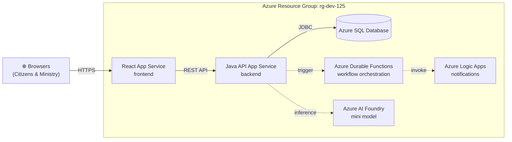

# Architecture

## Overview

The OPS Program Approval System is a bilingual (English/French) government web application that enables Ontario citizens to submit program approval requests and Ministry staff to review and approve them. The application follows a modern three-tier architecture deployed to Azure, with a React frontend, Java Spring Boot API backend, and Azure SQL database.

## System Diagram

> **Note:** Solid lines represent core data flow implemented in the demo. Dashed lines represent stretch-goal services that may be demonstrated if time permits.

## Azure Resources

| Resource | Type | Purpose |
|----------|------|---------|
| React App Service | App Service (Linux) | Hosts the React frontend SPA for citizen and ministry portals |
| Java API App Service | App Service (Linux) | Hosts the Spring Boot REST API backend |
| Azure SQL Database | SQL Database | Stores programs, program types, and notifications |
| Azure Durable Functions | Function App | Orchestrates multi-step approval workflows (stretch goal) |
| Azure Logic Apps | Logic App | Sends email notifications on status changes (stretch goal) |
| Azure AI Foundry | AI Services | Provides AI-assisted program description suggestions (stretch goal) |

## Data Flow

1. **Citizen submits program request** — User fills out the bilingual submission form in the React frontend
2. **React sends POST request** — Frontend submits `POST /api/programs` with program details to the Java API
3. **API validates and persists** — Spring Boot validates the request using Bean Validation, then persists to Azure SQL
4. **Ministry reviews submissions** — Ministry staff access the review dashboard to see pending programs
5. **Reviewer approves or rejects** — Staff submits `PUT /api/programs/{id}/review` with decision and comments
6. **Status updated in database** — Program status transitions from `SUBMITTED` to `APPROVED` or `REJECTED`
7. **(Stretch) Notification triggered** — Durable Functions orchestrates Logic Apps to send email notification

## Technology Stack

| Layer | Technology | Version |
|-------|------------|---------|
| Frontend | React + TypeScript + Vite | React 18, Vite 5 |
| Styling | Ontario Design System | `@ongov/ontario-design-system-global-styles` |
| i18n | i18next | `react-i18next`, `i18next-browser-languagedetector` |
| Backend | Java + Spring Boot | Java 21, Spring Boot 3.x |
| Database | Azure SQL (H2 locally) | H2 with `MODE=MSSQLServer` for local dev |
| Migrations | Flyway | Versioned migrations in `db/migration/` |

## Local Development

For local development, the architecture simplifies to:

- **Frontend**: Vite dev server on port 3000
- **Backend**: Spring Boot with H2 in-memory database on port 8080
- **Database**: H2 with `MODE=MSSQLServer` for SQL Server compatibility

See [docs/design-document.md](design-document.md) for API endpoint specifications and [docs/data-dictionary.md](data-dictionary.md) for database schema details.
