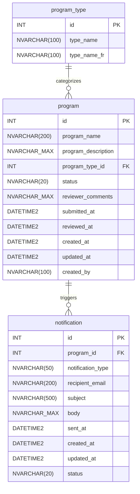

# Data Dictionary

## ER Diagram



## Tables

### program_type

Lookup table for program categorization. Stores bilingual names for dropdown display.

| Column | Type | Constraints | Description |
|--------|------|-------------|-------------|
| `id` | `INT` | `IDENTITY(1,1)`, `PRIMARY KEY` | Auto-generated unique identifier |
| `type_name` | `NVARCHAR(100)` | `NOT NULL` | English name for the program type |
| `type_name_fr` | `NVARCHAR(100)` | `NOT NULL` | French name for the program type |

### program

Core entity storing program approval requests submitted by citizens and reviewed by Ministry staff.

| Column | Type | Constraints | Description |
|--------|------|-------------|-------------|
| `id` | `INT` | `IDENTITY(1,1)`, `PRIMARY KEY` | Auto-generated unique identifier |
| `program_name` | `NVARCHAR(200)` | `NOT NULL` | Name of the program being submitted |
| `program_description` | `NVARCHAR(MAX)` | `NOT NULL` | Detailed description of the program |
| `program_type_id` | `INT` | `NOT NULL`, `FOREIGN KEY` | Reference to `program_type.id` |
| `status` | `NVARCHAR(20)` | `NOT NULL`, `DEFAULT 'DRAFT'` | Current status: `DRAFT`, `SUBMITTED`, `APPROVED`, `REJECTED` |
| `reviewer_comments` | `NVARCHAR(MAX)` | `NULL` | Comments from Ministry reviewer on approval/rejection |
| `submitted_at` | `DATETIME2` | `NULL` | Timestamp when program was submitted for review |
| `reviewed_at` | `DATETIME2` | `NULL` | Timestamp when program was approved or rejected |
| `created_at` | `DATETIME2` | `NOT NULL`, `DEFAULT GETDATE()` | Record creation timestamp |
| `updated_at` | `DATETIME2` | `NULL` | Last modification timestamp |
| `created_by` | `NVARCHAR(100)` | `NULL` | Username or email of the submitter |

### notification

System-generated records for tracking email notifications sent on status changes.

| Column | Type | Constraints | Description |
|--------|------|-------------|-------------|
| `id` | `INT` | `IDENTITY(1,1)`, `PRIMARY KEY` | Auto-generated unique identifier |
| `program_id` | `INT` | `NOT NULL`, `FOREIGN KEY` | Reference to `program.id` |
| `notification_type` | `NVARCHAR(50)` | `NOT NULL` | Type: `SUBMITTED`, `APPROVED`, `REJECTED` |
| `recipient_email` | `NVARCHAR(200)` | `NOT NULL` | Email address of the recipient |
| `subject` | `NVARCHAR(500)` | `NOT NULL` | Email subject line |
| `body` | `NVARCHAR(MAX)` | `NOT NULL` | Email body content |
| `sent_at` | `DATETIME2` | `NULL` | Timestamp when email was sent |
| `created_at` | `DATETIME2` | `NOT NULL`, `DEFAULT GETDATE()` | Record creation timestamp |
| `updated_at` | `DATETIME2` | `NULL` | Last modification timestamp |
| `status` | `NVARCHAR(20)` | `NOT NULL`, `DEFAULT 'PENDING'` | Send status: `PENDING`, `SENT`, `FAILED` |

## Status Lifecycle

Programs follow this status progression:

```text
DRAFT → SUBMITTED → APPROVED
                  ↘ REJECTED
```

| Status | Description | Transition Trigger |
|--------|-------------|-------------------|
| `DRAFT` | Initial state (database default) | Record creation |
| `SUBMITTED` | Awaiting Ministry review | `POST /api/programs` sets status explicitly |
| `APPROVED` | Program approved by reviewer | `PUT /api/programs/{id}/review` with `status=APPROVED` |
| `REJECTED` | Program rejected by reviewer | `PUT /api/programs/{id}/review` with `status=REJECTED` |

> **Note:** The `POST /api/programs` endpoint explicitly sets status to `SUBMITTED`, overriding the database default of `DRAFT`. This ensures programs enter the review queue immediately upon submission.

## Seed Data

The `program_type` table is pre-populated with 5 categories:

| id | type_name (EN) | type_name_fr (FR) |
|----|----------------|-------------------|
| 1 | Community Services | Services communautaires |
| 2 | Health & Wellness | Santé et bien-être |
| 3 | Education & Training | Éducation et formation |
| 4 | Environment & Conservation | Environnement et conservation |
| 5 | Economic Development | Développement économique |

### Seed Insertion Pattern

Use `INSERT ... WHERE NOT EXISTS` for idempotent seed data (never use `MERGE`):

```sql
INSERT INTO program_type (type_name, type_name_fr)
SELECT N'Community Services', N'Services communautaires'
WHERE NOT EXISTS (
    SELECT 1 FROM program_type WHERE type_name = N'Community Services'
);

INSERT INTO program_type (type_name, type_name_fr)
SELECT N'Health & Wellness', N'Santé et bien-être'
WHERE NOT EXISTS (
    SELECT 1 FROM program_type WHERE type_name = N'Health & Wellness'
);

INSERT INTO program_type (type_name, type_name_fr)
SELECT N'Education & Training', N'Éducation et formation'
WHERE NOT EXISTS (
    SELECT 1 FROM program_type WHERE type_name = N'Education & Training'
);

INSERT INTO program_type (type_name, type_name_fr)
SELECT N'Environment & Conservation', N'Environnement et conservation'
WHERE NOT EXISTS (
    SELECT 1 FROM program_type WHERE type_name = N'Environment & Conservation'
);

INSERT INTO program_type (type_name, type_name_fr)
SELECT N'Economic Development', N'Développement économique'
WHERE NOT EXISTS (
    SELECT 1 FROM program_type WHERE type_name = N'Economic Development'
);
```

## Related Documentation

- [Architecture](architecture.md) — System architecture and Azure resource overview
- [Design Document](design-document.md) — API endpoints and DTO specifications
